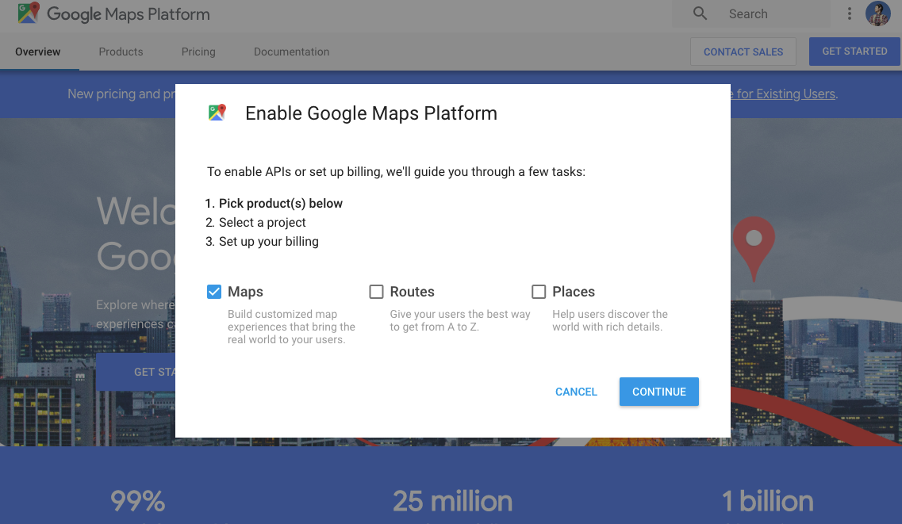
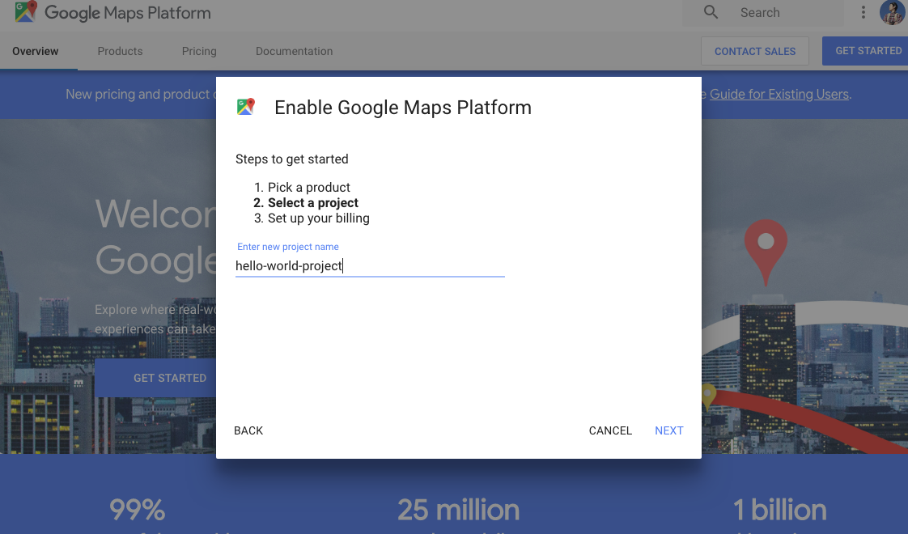
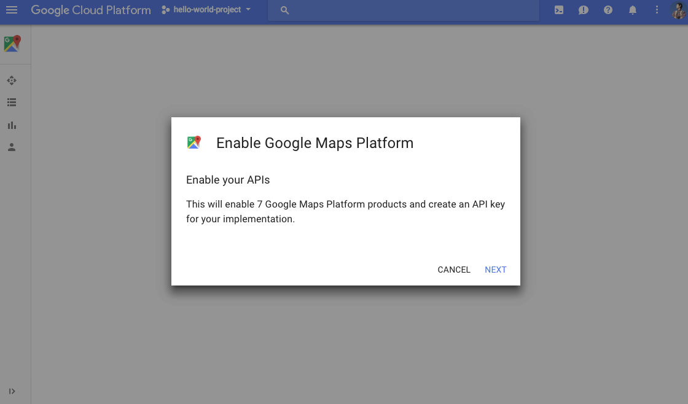
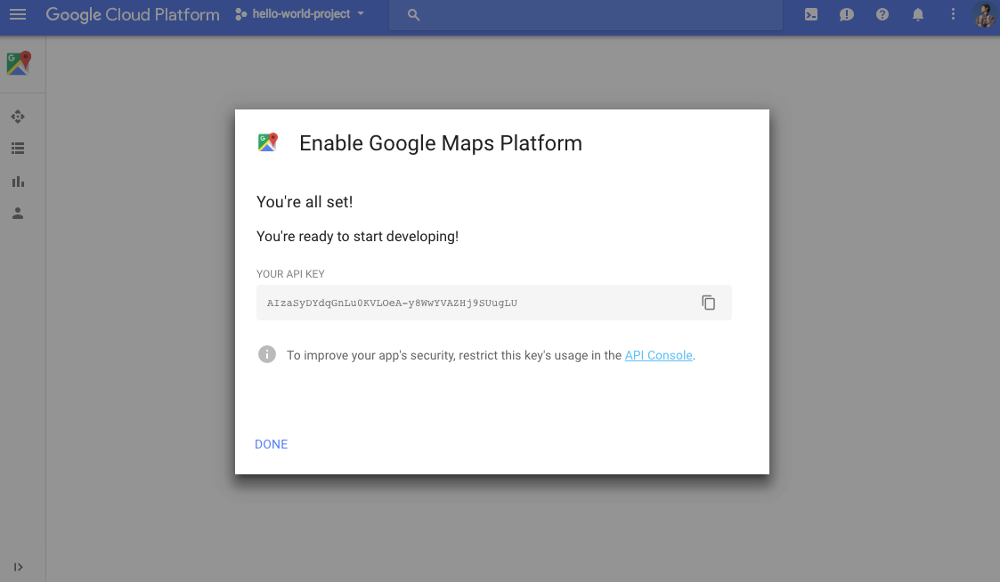

# How to generate API keys?

To use the cordova-plugin-googlemaps API, you must register your app project on the Google API Console and get a Google API key which you can add to your app.

## Quick guide to getting a key

----------------------------------------------------------------

### Create a project

https://cloud.google.com/maps-platform/#get-started

Go to the above url, which guides you through the process of registering a project in the Google API console, activates the Maps APIs, and generates a generic, unrestricted API key.

 
 

 
 

 
 

