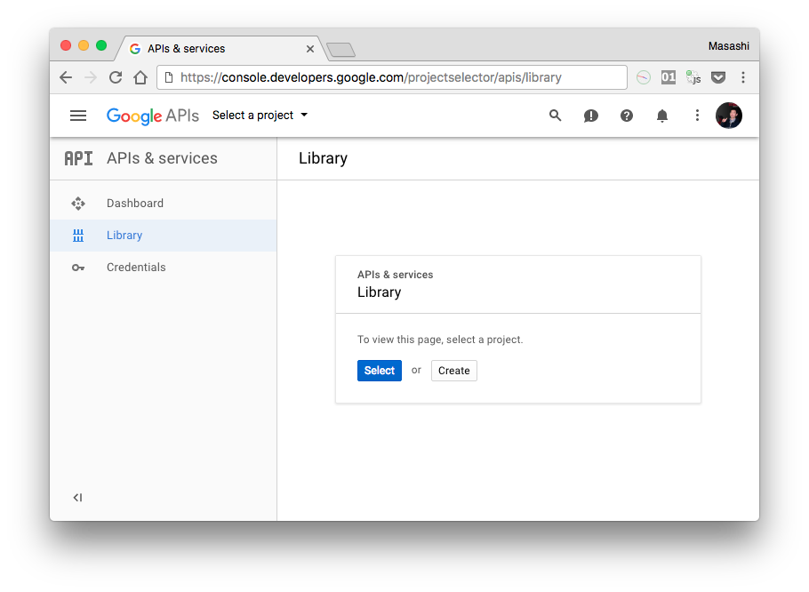
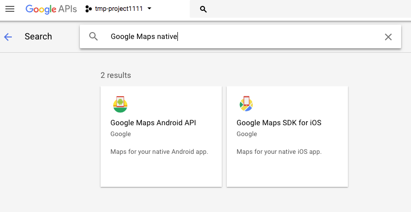
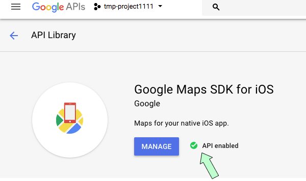
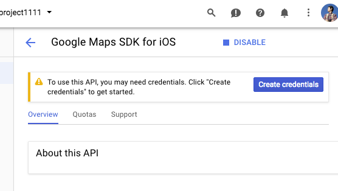
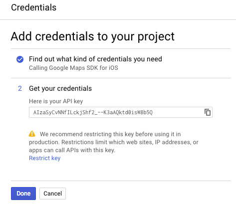
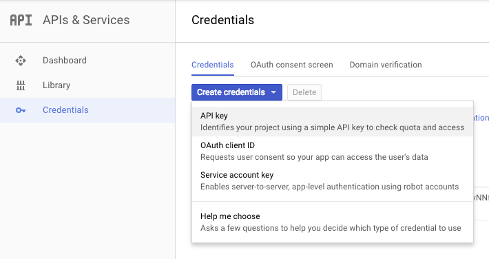

# How to generate API keys?

In order to use \@ionic-native/google-maps plugin, you need to generate API Keys at the Google Developers Console.

----

## Step 1: Create a project

Please go to this URL. Then create a project or choose existed project.
https://console.developers.google.com/projectselector/apis/library

----

## Step 2: Enable Google maps APIs

After creating a project, you will see the API Library list.
Type "Google Maps native", then please enable both APIs.

**[Important!]**
You need to enable the APIS **BEFORE** generating the API keys.

Make sure you enabled the API.

----

## Step 3: Generate API Keys

At the API page, click [Create credentials] button.

You will see the API list, choose `Google Maps Android API` or `Google Maps SDK for iOS`, then generate a key.

----

## If you need to regenerate API key...

click [Create credentials] button at the `Credentials` page, then choose `API key`. 

