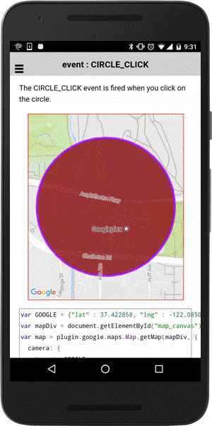

# event : CIRCLE_CLICK

The CIRCLE_CLICK event is fired when you click on the circle.

```typescript
circle.on(GoogleMapsEvent.CIRCLE_CLICK).subscribe((params: any[]) => {

})
```

## Parameters

name           | type          | description
---------------|---------------|---------------------------------------
params[0]      | LatLng        | clicked position
params[1]      | Circle        | circle instance itself


-----------------------------------------------------------------------

## Demo code

```html
<div id="map_canvas"></div>
```

```typescript
map: GoogleMap;

loadMap() {
  let GOOGLE: ILatLng = {"lat" : 37.422858, "lng" : -122.085065};
  this.map = GoogleMaps.create('map_canvas', {
    camera: {
      target: GOOGLE
    },
    gestures: {
      'scroll': false,
      'tilt': false,
      'rotate': false,
      'zoom': false
    }
  });

  // Add a circle
  let circle: Circle = this.map.addCircleSync({
    'center': GOOGLE,
    'radius': 300,
    'strokeColor' : '#AA00FF',
    'strokeWidth': 5,
    'fillColor' : '#880000',
    'clickable' : true   // default = false
  });

  this.map.moveCamera({
    target: circle.getBounds()
  });

  // Listen the CIRCLE_CLICK event
  circle.on(GoogleMapsEvent.CIRCLE_CLICK).subscribe(this.onCircleClick.bind(this));
}

onCircleClick((params: any[]) => {
  let latLng: LatLng = params[0];
  let circle: Circle = params[1];

  // You can change the style for instance.
  circle.setFillColor("blue");
  circle.setStrokeColor("green");
  circle.setStrokeWidth(10);

  let marker: Marker = this.map.addMarkerSync({
    position: latLng,
    title: "You clicked here on the circle!",
    snippet: latLng.toUrlValue()
  });
  marker.showInfoWindow();

});

```


