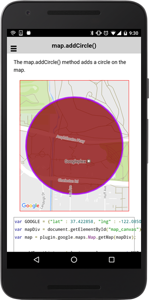
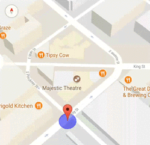

# Circle class

_This class extends [BaseClass](../baseclass/README.md)_.

## Contents

  - <a href="#overview">Overview</a>
    - <a href="#create-one-circle">Create one circle</a>
    - <a href="#circle_click-event">Click event</a>
    - <a href="#bindto-method">bindTo() method</a>
  - <a href="#api-reference">API Reference</a>

------------

## Overview


### Create one circle

The **map.addCircleSync()** method adds one circle onto the map.

```typescript
loadMap() {

  let GOOGLE: ILatLng = {"lat" : 37.422858, "lng" : -122.085065};
  this.map = GoogleMaps.create('map_canvas');

  // Add circle
  let circle: Circle = this.map.addCircleSync({
    'center': GOOGLE,
    'radius': 300,
    'strokeColor' : '#AA00FF',
    'strokeWidth': 5,
    'fillColor' : '#880000'
  });

  this.map.moveCamera({
    target: circle.getBounds()
  });

}
```



---------------------------------------------------------------

### Listen CIRCLE_CLICK event

In order to listen the CIRCLE_CLICK event, you need to specify the `clickable` option.
You can get the latitude/longitude pair of clicked position.

```typescript
loadMap() {

  // Add a circle
  let circle: Circle = this.map.addCircleSync({
    'center': GOOGLE,
    'radius': 300,
    'strokeColor' : '#AA00FF',
    'strokeWidth': 5,
    'fillColor' : '#880000',
    'clickable' : true   // default = false
  });

  this.map.moveCamera({
    target: circle.getBounds()
  });

  // Catch the CIRCLE_CLICK event
  circle.on(GoogleMapsEvent.CIRCLE_CLICK).subscribe(this.onCircleClick.bind(this));

}

onCircleClick(params: any[]) {
  let latLng: ILatLng = params[0];
  let circle: Circle = params[1];

  ...
}
```


---------------------------------------------------------------

#### bindTo() method

The `bindTo()` method is useful when you manipulate multiple overlays with the same value. The `bindTo()` method comes from [BaseClass](../baseclass/README.md).

```typescript
loadMap() {
  ...

  let marker: Marker = this.map.addMarkerSync({
    position: {lat: 43.0741704, lng: -89.3809802},
    draggable: true
  });

  let circle: Circle = this.map.addCircleSync({
    center: marker.getPosition(),
    radius: 10,
    fillColor: "rgba(0, 0, 255, 0.5)",
    strokeColor: "rgba(0, 0, 255, 0.75)",
    strokeWidth: 1
  });

  // circle.center = marker.position
  marker.bindTo("position", circle, "center");
}
```




---------------------------------------------------------------
## API Reference
---------------------------------------------------------------

## Create methods

- ### map.addCircle() [:orange_book:](./addCircle/README.md)

  Adds a circle onto the map **asynchronously**.

  :arrow_right: Returns `Promise<Circle>`

- ### map.addCircleSync() [:orange_book:](./addCircleSync/README.md)

  Adds a circle onto the map **synchronously**.

  :arrow_right: Returns `Circle`


------------------------------------------------------------------------

## Instance methods

- ### getId()

  Returns the ID of instance.

  :arrow_right: Returns `string`

- ### getMap()

  Return the map instance.

  :arrow_right: Returns [GoogleMap](../googlemap/README.md) instance.

- ### setCenter(latLng) [:orange_book:](./setCenter/README.md)

  Changes the center position.

  <table>
  <tr>
    <th>Params</th>
    <th>Type</th>
    <th>Details</th>
  </tr>
  <tr>
    <td>latLng</td>
    <td><a href="../ilatlng/README.md">ILatLng</a></td>
    <td>new position</td>
  </tr>
  </table>


- ### getCenter()

  Returns the current center position

  :arrow_right: Returns [ILatLng](../ilatlng/README.md).


- ### setRadius(radius) [:orange_book:](./setRadius/README.md)

  Changes the circle radius.

  <table>
  <tr>
    <th>Params</th>
    <th>Type</th>
    <th>Details</th>
  </tr>
  <tr>
    <td>radius</td>
    <td>number</td>
    <td>Radius in meter</td>
  </tr>
  </table>


- ### getRadius()

  Returns the current circle radius.

  :arrow_right: Returns `number`.

- ### setFillColor(color) [:orange_book:](./setFillColor/README.md)

  Changes the filling color (inner color).

  <table>
  <tr>
    <th>Params</th>
    <th>Type</th>
    <th>Details</th>
  </tr>
  <tr>
    <td>color</td>
    <td>number</td>
    <td>HTML color strings</td>
  </tr>
  </table>


- ### getFillColor()

  Returns the current circle filling color (inner color).

  :arrow_right: Returns `string`.


- ### setStrokeWidth(strokeWidth) [:orange_book:](./setStrokeWidth/README.md)

  Changes the stroke width.

  <table>
  <tr>
    <th>Params</th>
    <th>Type</th>
    <th>Details</th>
  </tr>
  <tr>
    <td>strokeWidth</td>
    <td>number</td>
    <td>stroke width in pixel</td>
  </tr>
  </table>


- ### getStrokeWidth()

  Returns the current circle stroke width (unit: pixel).

  :arrow_right: Returns `number`.

- ### setStrokeColor(color)

  Changes the stroke color (outter color).

  <table>
  <tr>
    <th>Params</th>
    <th>Type</th>
    <th>Details</th>
  </tr>
  <tr>
    <td>color</td>
    <td>string</td>
    <td>HTML color strings</td>
  </tr>
  </table>


- ### getStrokeColor()

  Returns the current circle stroke color (outer color).

  :arrow_right: Returns `string`.


- ### setClickable(clickable) [:orange_book:](./setClickable/README.md)

  Changes click-ability of the circle.

  <table>
  <tr>
    <th>Params</th>
    <th>Type</th>
    <th>Details</th>
  </tr>
  <tr>
    <td>clickable</td>
    <td>boolean</td>
    <td>true or false</td>
  </tr>
  </table>


- ### getClickable()

  Returns true if the circle is clickable.

  :arrow_right: Returns `boolean`.

- ### setVisible(clickable) [:orange_book:](./setVisible/README.md)

  Set circle visibility

  <table>
  <tr>
    <th>Params</th>
    <th>Type</th>
    <th>Details</th>
  </tr>
  <tr>
    <td>visible</td>
    <td>boolean</td>
    <td>true or false</td>
  </tr>
  </table>


- ### getVisible()

  Returns true if the circle is visible.

  :arrow_right: Returns `boolean`.


- ### getBounds()

  Returns the latLngBounds (rectangle) that contains the circle.

  :arrow_right: Returns [LatLngBounds](../latlngbounds/README.md).


- ### setZIndex(index) [:orange_book:](./setZIndex/README.md)

  Changes the circle zIndex order.

  <table>
  <tr>
    <th>Params</th>
    <th>Type</th>
    <th>Details</th>
  </tr>
  <tr>
    <td>index</td>
    <td>number</td>
    <td>z-index</td>
  </tr>
  </table>


- ### getZIndex()

  Returns the current circle zIndex.

  :arrow_right: Returns `number`.

- ### remove() [:orange_book:](./setZIndex/README.md)

  Remove the circle.

------------------------------------------------------------------------

## Event

- ### CIRCLE_CLICK [:orange_book:](./CIRCLE_CLICK/README.md)

  This event is fired when you click on a circle.

  <table>
  <tr>
    <th>Params</th>
    <th>Type</th>
    <th>Details</th>
  </tr>
  <tr>
    <td>params[0]</td>
    <td>LatLng</td>
    <td>clicked position</td>
  </tr>
  <tr>
    <td>params[1]</td>
    <td>Circle</td>
    <td>circle instance</td>
  </tr>
  </table>
