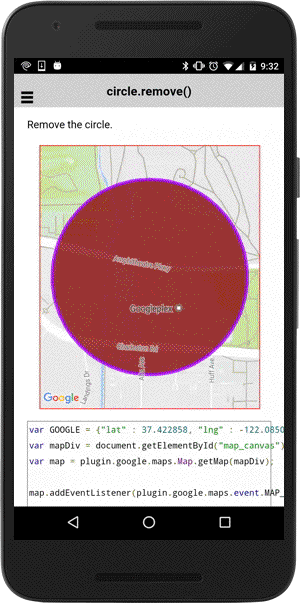

# circle.remove()

Remove the circle.

```
circle.remove()
```

------------------------------------------------------------------------------------------

## Demo code

```html
<div id="map_canvas"></div>
```

```typescript
map: GoogleMap;

loadMap() {
  let GOOGLE: ILatLng = {"lat" : 37.422858, "lng" : -122.085065};
  this.map = GoogleMaps.create('map_canvas');

  // Add a circle
  let circle: Circle = this.map.addCircleSync({
    'center': GOOGLE,
    'radius': 300,
    'strokeColor' : '#AA00FF',
    'strokeWidth': 5,
    'fillColor' : '#880000',
    'clickable' : true   // default = false
  });

  this.map.moveCamera({
    target: circle.getBounds()
  });

  // Listen the CIRCLE_CLICK event
  circle.on(GoogleMapsEvent.CIRCLE_CLICK).subscribe(this.onCircleClick.bind(this));
}


onCircleClick((params: any[]) => {
  //let latLng: LatLng = params[0];
  let circle: Circle = params[1];

  // Remove the circle
  circle.remove();
});
```


