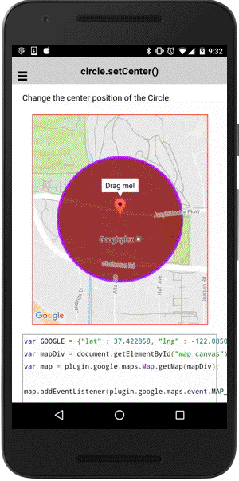

# circle.setCenter()

Change the center position of the Circle.

```
circle.setCenter(latLng);
```


## Parameters

name           | type          | description
---------------|---------------|---------------------------------------
latLng         | ILatLng       | new center position
-----------------------------------------------------------------------


## Demo code

```html
<div id="map_canvas"></div>
```

```typescript
map: GoogleMap;

loadMap() {
  let GOOGLE: ILatLng = {"lat" : 37.422858, "lng" : -122.085065};
  this.map = GoogleMaps.create('map_canvas');

  // Add a circle
  let circle: Circle = this.map.addCircleSync({
    'center': GOOGLE,
    'radius': 300,
    'strokeColor' : '#AA00FF',
    'strokeWidth': 5,
    'fillColor' : '#880000',
    'clickable' : true   // default = false
  });

  this.map.moveCamera({
    target: circle.getBounds(),
    padding: 50
  });

  let marker: Marker = map.addMarkerSync({
    position: circle.getCenter(),
    draggable: true,
    title: "Drag me!"
  });

  marker.showInfoWindow();

  // circle.center = marker.position
  marker.bindTo("position", circle, "center");
}
```


