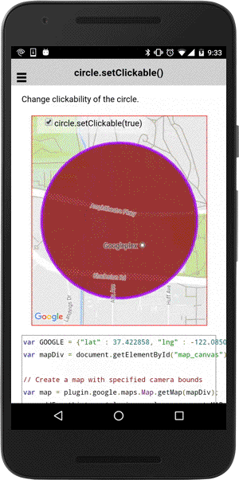

# circle.setClickable()

Enables or disables click events for this circle.

```
circle.setClickable(flag);
```


## Parameters

name           | type          | description
---------------|---------------|---------------------------------------
flag           | boolean       | `true`: clickable, `false`: non-clickable
-----------------------------------------------------------------------

## Demo code

```html
<div class="map" id="map_canvas">
  <span class="smallPanel"><input type="checkbox"  (click)="toggleClickable()" checked="checked">circle.setClickable(true)</span>
</div>
```

```typescript
map: GoogleMap;
circle: Circle;
isClickable: boolean = true;

loadMap() {
  let GOOGLE: ILatLng = {"lat" : 37.422858, "lng" : -122.085065};
  this.map = GoogleMaps.create('map_canvas');

  // Add a circle
  this.circle = this.map.addCircleSync({
    'center': GOOGLE,
    'radius': 300,
    'strokeColor' : '#AA00FF',
    'strokeWidth': 5,
    'fillColor' : '#880000',
    'clickable' : true   // default = false
  });

  this.map.moveCamera({
    target: circle.getBounds(),
    padding: 50
  });

  // Catch the CIRCLE_CLICK event
  this.circle.on(GoogleMapsEvent.CIRCLE_CLICK).subscribe(() => {
    alert("The circle is clicked!");
  });
}

toggleClickable() {
  // Toggle clickable and non-clickable
  this.circle.setClickable(checkbox.checked);
}
```


