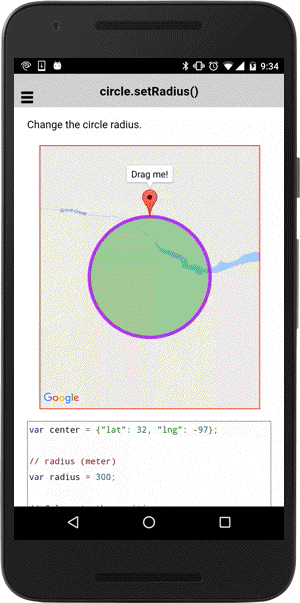

# circle.setRadius()

Sets the radius of this circle.

```
circle.setRadius(radius);
```

## Parameters

name           | type          | description
---------------|---------------|---------------------------------------
radius         | number        | radius in meters.
-----------------------------------------------------------------------

## Demo code

```html
<div id="map_canvas"></div>
```


```typescript
map: GoogleMap;

loadMap() {
  let center: ILatLng = {"lat": 32, "lng": -97};

  // radius (meter)
  let radius: number = 300;

  // Calculate the positions
  let deg0: ILatLng = Spherical.computeOffset(center, radius, 0);
  let deg90: ILatLng = Spherical.computeOffset(center, radius, 90);
  let deg180: ILatLng = Spherical.computeOffset(center, radius, 180);
  let deg270: ILatLng = Spherical.computeOffset(center, radius, 270);

  this.map = GoogleMaps.create('map_canvas', {
    camera: {
      target: [
        center,
        deg0,
        deg90,
        deg180,
        deg270
      ],
      padding: 100
    }
  });

  let marker: Marker = map.addMarkerSync({
    'position': deg0,
    'draggable': true,
    'title': 'Drag me!'
  });

  marker.showInfoWindow();

  // Add circle
  let circle: Circle = map.addCircleSync({
    'center': center,
    'radius': radius,
    'strokeColor' : '#AA00FF',
    'strokeWidth': 5,
    'fillColor' : '#00880055'
  });

  marker.on("position_changed").subscribe((params: any[]) => {
    let latLng: ILatLng = params[0];

    // Calculate distance between center and the marker position
    let newRadius: number = Spherical.computeDistanceBetween(center, latLng);

    // Update the radius
    circle.setRadius(newRadius);
  });
}
```


