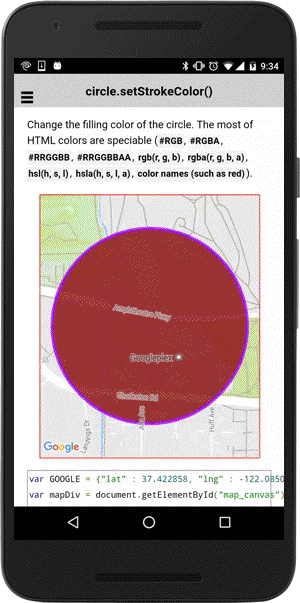

# circle.setStrokeColor()

Change the color of the circle outline.

```
circle.setStrokeColor(color);
```

## Parameters

name           | type          | description
---------------|---------------|---------------------------------------
color          | string        | HTML color strings (i.e., `red`, `rgb(255, 0, 255)`)
-----------------------------------------------------------------------

## Demo code

```html
<div id="map_canvas"></div>
```

```typescript
map: GoogleMap;

loadMap() {
  let GOOGLE: ILatLng = {"lat" : 37.422858, "lng" : -122.085065};
  this.map = GoogleMaps.create('map_canvas');

  // Add a circle
  let circle: Circle = this.map.addCircleSync({
    'center': GOOGLE,
    'radius': 300,
    'strokeColor' : '#AA00FF',
    'strokeWidth': 5,
    'fillColor' : '#880000',
    'clickable' : true   // default = false
  });

  this.map.moveCamera({
    target: circle.getBounds(),
    padding: 50
  });

  // Change the stroke color.
  let idx: number = 0;
  circle.on(plugin.google.maps.event.CIRCLE_CLICK).subscribe(() => {

    // Available HTML colors
    // https://github.com/mapsplugin/cordova-plugin-googlemaps-doc/blob/master/v1.4.0/Available-HTML-colors/README.md
    circle.setStrokeColor(["skyblue", "lime", "tomato", "bisque"][idx++]);
    idx = idx > 3 ? 0 : idx;

  });
}
```


