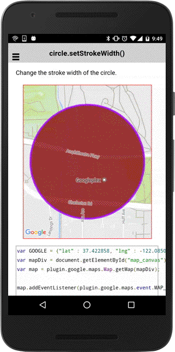

# circle.setStrokeWidth()

Change the stroke width of the circle.

```
circle.setStrokeWidth(width);
```

## Parameters

name           | type          | description
---------------|---------------|---------------------------------------
width          | number        | The width of the circle's outline in screen pixels.
-----------------------------------------------------------------------

## Demo code

```html
<div id="map_canvas"></div>
```

```typescript
map: GoogleMap;

loadMap() {
  let GOOGLE: ILatLng = {"lat" : 37.422858, "lng" : -122.085065};
  this.map = GoogleMaps.create('map_canvas');

  // Add a circle
  let circle: Circle = this.map.addCircleSync({
    'center': GOOGLE,
    'radius': 300,
    'strokeColor' : '#AA00FF',
    'strokeWidth': 5,
    'fillColor' : '#880000',
    'clickable' : true   // default = false
  });

  this.map.moveCamera({
    target: circle.getBounds(),
    padding: 50
  });

  circle.on(plugin.google.maps.event.CIRCLE_CLICK).subscribe(() => {

    // Change the stroke width
    circle.setStrokeWidth(20);
  });
}
```


