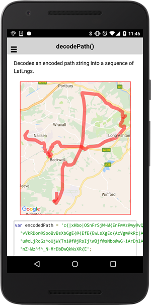

# Encoding.decodePath()

Decodes an encoded path string into a sequence of [LatLng](../latlng/README.md)s.

```typescript
Encoding.decodePath(encoded, precision)
```

## Parameters

name           | type     | description
---------------|----------|---------------------------------------
encoded        | string   | Encoded string
precision?     | number   | (optional) default: 5

## Return value

:arrow_right: Returns `string`

------------------------------------------------------------------

## Demo code

```typescript
<div id="map_canvas"></div>
```

```typescript
map: GoogleMap;

loadMap() {
  let encodedPath: string = 'c{|xHbo|OSnFrSjW~M{EnFwVz@wy@vQsq@cBoUzJ{EzObBrIcLfE~C~H{Y~C~CfOgY{EjM{EgTcLzTsSwQcGf@IoKgJSkMsb@RkR' +
'vVkRDon@SooBvBsXbGgE{@{EfE{EwLsXgEo{AcVgw@kRc|A_q@seAcLg@bBvQkCnKcGjCwQsSkM?cL{YjHrS{J~HgOwBgOjf@{Jj' +
'u@cLjRcGz^oUjW{Tni@f@jRsIj\wBjf@sNbo@wG~iArDnlArIj\bGfr@bQf^~WrSnPvVfOjHnURzc@cQbQzc@nUrtAbBfYkC~M~H' +
'nZ~Mz^f^_N~MrDbBwQkWsXR{E';

  let points: ILatLng[] = Encoding.decodePath(encodedPath);
  console.log(points);

  this.map = GoogleMaps.create('map_canvas', {
    camera: {
      target: points
    }
  });

  // Add a polygon
  this.map.addPolylineSync({
    'points': points
  });
}
```


