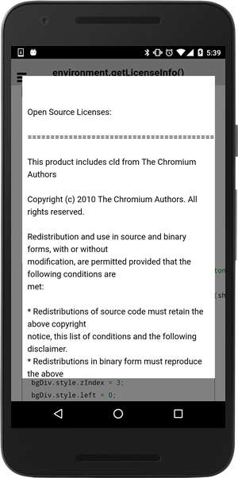

# Environment.getLicenseInfo()

Get the open source software license information for ~~Google Maps Android API v2 and~~ Google Maps SDK for iOS.

If you use this plugin in your application, you **MUST** include the license attribution text as part of a **"Legal Notices"** section in your application.
Including legal notices as an independent menu item, or as part of an "About" menu item, is recommended.

This is requirement by ~~Google Maps Android API v2 and~~ Google Maps SDK for iOS.

```html
<button ion-button (click)="onButtonClick()">
Click here!
</button>
```

```typescript
onButtonClick() {
  Environment.getLicenseInfo().then(license => {
    let popup = this.modalCtrl.create(LicensePopupPage, {
      message: license
    });
    popup.present({
      ev: $event
    });
  });
}
```


