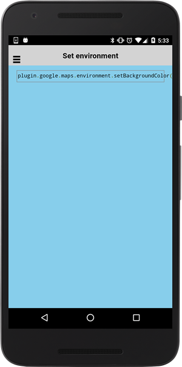

# Environment.setBackgroundColor()

Specifies the background color of the app.

Available HTML colors are defined at https://github.com/mapsplugin/cordova-plugin-googlemaps-doc/tree/master/v1.4.0/Available-HTML-colors

```typescript
ionViewDidLoad() {
  console.log('ionViewDidLoad SetBackgroundColorPage');
  Environment.setBackgroundColor('skyblue');
}
```


