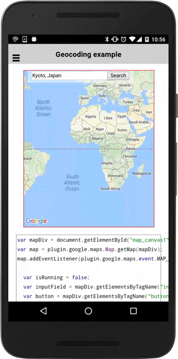
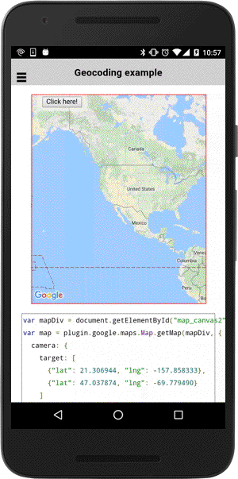

# Geocoding

## Basic usage

This plugin supports geocoding. You can convert address or landscape names to latitude and longitude.

In Android, this plugin uses Google Play Services feature, while in iOS this plugin uses iOS feature (not Google).
It means the geocoding results are different on Android and iOS.

```html
<div id="map_canvas1">
  <input ion-input [(ngModel)]="search_address" value="Kyoto, Japan"><button ion-button (click)="onButton1_click($event)">Search</button>
</div>
```

```typescript
map1: GoogleMap;
search_address: any;

loadMap1() {
  this.search_address = 'Kyoto, Japan';
  this.map1 = GoogleMaps.create('map_canvas1');
}

onButton1_click(event) {

  // Address -> latitude,longitude
  Geocoder.geocode({
    "address": this.search_address
  }).then((results: GeocoderResult[]) => {
    console.log(results);

    if (!results.length) {
      this.isRunning = false;
      return null;
    }

    // Add a marker
    let marker: Marker = this.map1.addMarkerSync({
      'position': results[0].position,
      'title':  JSON.stringify(results[0].position)
    });

    // Move to the position
    this.map1.animateCamera({
      'target': marker.getPosition(),
      'zoom': 17
    }).then(() => {
      marker.showInfoWindow();
      this.isRunning = false;
    });
  });

}
```




----

## Multiple locations

You can pass multiple location in one request as Array.
In this case, the method passes an instance of [BaseArrayClass](../../BaseArrayClass/README.md),
then you will receive each results one by one.

The instance of [BaseArrayClass](../../BaseArrayClass/README.md) triggers the `finish` event
when all requests are completed.

If any error occurs during the requests processing, the instance triggers `error` event.


```html
<div id="map_canvas2">
  <button ion-button (click)="onButton2_click($event)">Click here!</button>
</div>
```

```typescript
map2: GoogleMap;
isRunning: boolean = false;

loadMap2() {
  this.map2 = GoogleMaps.create('map_canvas2', {
    camera: {
      target: [
        {"lat": 21.306944, "lng": -157.858333},
        {"lat": 47.037874, "lng": -69.779490}
      ]
    }
  });
}


onButton2_click(event) {
  if (this.isRunning) {
    return;
  }
  this.isRunning = true;

  let start: number = Date.now();

  // Geocode multiple location
  Geocoder.geocode({

    // US Capital cities
    "address": [
      "Montgomery, AL, USA", "Juneau, AK, USA", "Phoenix, AZ, USA",
      "Little Rock, AR, USA", "Sacramento, CA, USA", "Denver, CO, USA",
      "Hartford, CT, USA", "Dover, DE, USA", "Washington, DC, USA",
      "Tallahassee, FL, USA", "Atlanta, GA, USA", "Honolulu, HI, USA",
      "Boise, ID, USA", "Springfield, IL, USA", "Indianapolis, IN, USA",
      "Des Moines, IA, USA", "Topeka, KS, USA", "Frankfort, KY, USA",
      "Baton Rouge, LA, USA", "Augusta, ME, USA", "Annapolis, MD, USA",
      "Boston, MA, USA", "Lansing, MI, USA", "Saint Paul, MN, USA",
      "Jackson, MS, USA", "Jefferson City, MO, USA", "Helena, MT, USA",
      "Lincoln, NE, USA", "Carson City, NV, USA", "Concord, NH, USA",
      "Trenton, NJ, USA", "Santa Fe, NM, USA", "Albany, NY, USA",
      "Raleigh, NC, USA", "Bismarck, ND, USA", "Columbus, OH, USA",
      "Oklahoma City, OK, USA", "Salem, OR, USA", "Harrisburg, PA, USA",
      "Providence, RI, USA", "Columbia, SC, USA", "Pierre, SD, USA",
      "Nashville, TN, USA", "Austin, TX, USA", "Salt Lake City, UT, USA",
      "Montpelier, VT, USA", "Richmond, VA, USA", "Olympia, WA, USA",
      "Charleston, WV, USA", "Madison, WI, USA", "Cheyenne, Wyoming, USA"
    ]
  }).then((mvcArray: BaseArrayClass<GeocoderResult>) => {

    mvcArray.on('finish').then(() => {
      if (mvcArray.getLength() > 0) {
        let results: any[] =  mvcArray.getArray();
        results.forEach((result: GeocoderResult[]) => {
          this.map2.addMarkerSync({
            'position': result[0].position,
            'title':  JSON.stringify(result)
          });
        });
      }

      let end = Date.now();
      this.isRunning = false;
      alert("duration: " + ((end - start) / 1000).toFixed(1) + " seconds");
    });

  });
}
```


