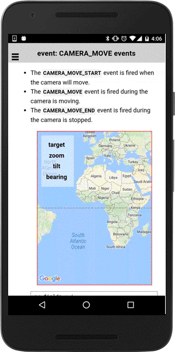

# CAMERA_MOVE events

These events are fired when the camera moves.

- The `CAMERA_MOVE_START` event is fired when the camera moving starts.</li>
- The `CAMERA_MOVE` event is fired while the camera is moving.</li>
- The `CAMERA_MOVE_END` event is fired when the camera is stopped.</li>

```typescript
map.on(GoogleMapsEvent.CAMERA_MOVE_END).subscribe((params: any[]) => {

})
```

## Parameters

name           | type                                                    | description
---------------|---------------------------------------------------------|---------------------------------------
params[0]      | [CameraPosition](../../cameraposition/README.md)        | clicked position
params[1]      | GoogleMap                                               | map instance itself


----------------------------------------------------------------------------------------------------------

## Demo code

```html
<div class="map" id="map_canvas">
  <table  class="smallPanel">
    <tr>
      <th rowspan="2">target</th>
      <td *ngIf="camera_target_lat">{{camera_target_lat}}></td>
    </tr>
    <tr>
      <td *ngIf="camera_target_lng">{{camera_target_lat}}></td>
    </tr>
    <tr>
      <th>zoom</th>
      <td *ngIf="camera_zoom">{{camera_zoom}}></td>
    </tr>
    <tr>
      <th>tilt</th>
      <td *ngIf="camera_tilt">{{camera_tilt}}></td>
    </tr>
    <tr>
      <th>bearing</th>
      <td *ngIf="camera_bearing">{{camera_bearing}}></td>
    </tr>
  </table>
</div>
```

```typescript
map: GoogleMap;
camera_target_lat: number;
camera_target_lng: number;
camera_zoom: number;
camera_tilt: number;
camera_bearing: number;

loadMap() {
  this.map = GoogleMaps.create('map_canvas');

  // Catch all camera events
  this.map.on(GoogleMapsEvent.CAMERA_MOVE_START).subscribe(this.onCameraEvents.bind(this));
  this.map.on(GoogleMapsEvent.CAMERA_MOVE).subscribe(this.onCameraEvents.bind(this));
  this.map.on(GoogleMapsEvent.CAMERA_MOVE_END).subscribe(this.onCameraEvents.bind(this));

}

onCameraEvents(params: any[]) {
  // Display the current camera position
  let cameraPosition: CameraPosition<ILatLng> = params[0];

  this._ngZone.run(() => {
    this.camera_target_lat = cameraPosition.target.lat;
    this.camera_target_lng = cameraPosition.target.lng;
    this.camera_zoom = cameraPosition.zoom;
    this.camera_tilt = cameraPosition.tilt;
    this.camera_bearing = cameraPosition.bearing;
  });
}
```


