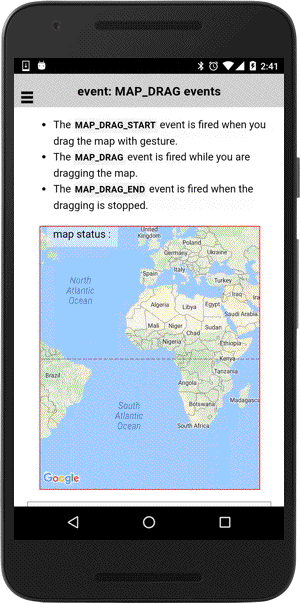

# MAP_DRAG events

These events are fired when the camera moves.

- The `MAP_DRAG_START` event is fired when you drag the map with gesture.</li>
- The `MAP_DRAG` event is fired while you are dragging the map.</li>
- The `MAP_DRAG_END` event is fired when the dragging is stopped.</li>

```typescript
map.on(GoogleMapsEvent.MAP_DRAG_END).subscribe((params: any[]) => {

})
```

## Parameters

name           | type                                    | description
---------------|-----------------------------------------|---------------------------------------
params[0]      | GoogleMap                               | map instance itself

----------------------------------------------------------------------------------------------------------

## Demo code

```html
<div class="map" id="map_canvas">
    <span class="smallPanel">${{label}}</span>
</div>
```

```typescript
map: GoogleMap;
label: any;

loadMap() {
  this.map = GoogleMaps.create("map_canvas");

  this.map.on(plugin.google.maps.event.MAP_CLICK).subscribe((params: any[]) => {
    let latLng: LatLng = params[0];

    this.map.addMarkerSync({
      position: latLng,
      title: latLng,
      animation: GoogleMapsAnimation.DROP
    });
  });

  // Catch all camera events
  this.map.on(GoogleMapsEvent.MAP_DRAG_START).subscribe(() => {
    this.updateLabel(GoogleMapsEvent.MAP_DRAG_START);
  });
  this.map.on(GoogleMapsEvent.MAP_DRAG).subscribe(() => {
    this.updateLabel(GoogleMapsEvent.MAP_DRAG);
  });
  this.map.on(GoogleMapsEvent.MAP_DRAG_END).subscribe(() => {
    this.updateLabel(GoogleMapsEvent.MAP_DRAG_END);
  });
}

updateLabel(eventName: string) {
  this._ngZone.run(() => {
    this.label = eventName;
  });
}
```


