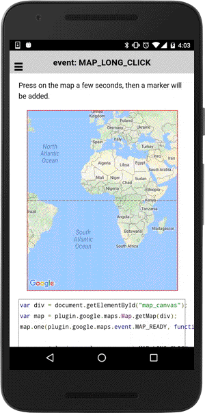

# MAP_LONG_CLICK event

This event is fired when you long-click on the map.

```typescript
map.on(GoogleMapsEvent.MAP_LONG_CLICK).subscribe((params: any[]) => {

})
```

## Parameters

name           | type                                    | description
---------------|-----------------------------------------|---------------------------------------
params[0]      | [LatLng](../../latlng/README.md)        | clicked position
params[1]      | GoogleMap                               | map instance itself


----------------------------------------------------------------------------------------------------------

## Demo code

```html
<div id="map_canvas"></div>
```

```typescript
map: GoogleMap;

loadMap() {
  this.map = GoogleMaps.create("map_canvas");

  this.map.on(GoogleMapsEvent.MAP_LONG_CLICK).subscribe((params: any[]) => {
    let latLng: LatLng = params[0];

    this.map.addMarkerSync({
      position: latLng,
      title: latLng,
      animation: GoogleMapsAnimation.DROP
    });
  });
});
```


