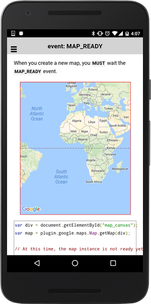

# MAP_READY event

This event is fired when the native map view is fully ready.

```typescript
map.on(GoogleMapsEvent.MAP_READY).subscribe((params: any[]) => {

})
```

## Parameters

name           | type                                    | description
---------------|-----------------------------------------|---------------------------------------
params[0]      | GoogleMap                               | map instance itself


----------------------------------------------------------------------------------------------------------

## Demo code

```html
<div id="map_canvas"></div>
```

```typescript
map: GoogleMap;

loadMap() {
  this.map = GoogleMaps.create("map_canvas");

  // At this time, the map instance is not ready yet.
  // So don't do anything.
  //
  // map.getVisibleRegion();  <--- This is bad timing.


  // After the MAP_READY event, you can modify the map.
  this.map.one(GoogleMapsEvent.MAP_READY).then(() => {
    let visibleRegion: VisibleRegion = this.map.getVisibleRegion();
  });
});

```


