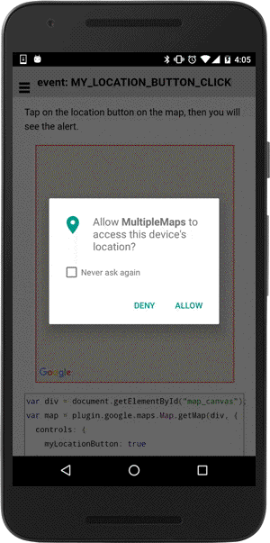

# MY_LOCATION_BUTTON_CLICK event

This event is fired when you tap on the location button.

```typescript
map.on(GoogleMapsEvent.MY_LOCATION_BUTTON_CLICK).subscribe((params: any[]) => {

})
```

## Parameters

name           | type                                    | description
---------------|-----------------------------------------|---------------------------------------
params[0]      | GoogleMap                               | map instance itself


----------------------------------------------------------------------------------------------------------

## Demo code

```html
<div id="map_canvas"></div>
```

```typescript
LocationService.getMyLocation().then((result: MyLocation) => {

  // Display the current location map
  this.map = GoogleMaps.create('map_canvas', {
    "camera": {
      "target": {
        "lat": 37.422858,
        "lng": -122.085065
      },
      "zoom": 15
    },
    'controls': {
      'myLocationButton': true,
      'myLocation': true  // try `myLocation = false`
    }
  });
  this.map.on(GoogleMapsEvent.MY_LOCATION_BUTTON_CLICK).subscribe(() => {
    alert("The my location button is clicked.");
  });
});
```


