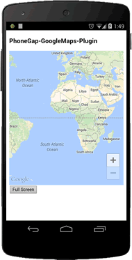
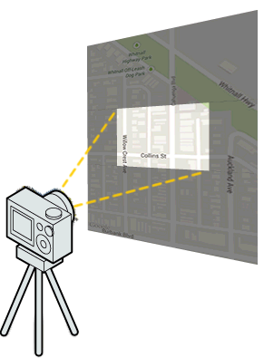
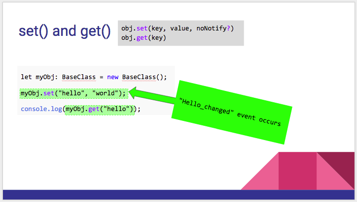

# GoogleMap class

_This class extends [BaseClass](../BaseClass/README.md)_.

## Contents

  - <a href="#overview">Overview</a>
    - <a href="#create-a-map">Create a map</a>
    - <a href="#how-does-the-plugin-work">How does the plugin work</a>
    - <a href="#events">Events</a>
    - <a href="#camera">Camera</a>
  - <a href="#api-reference">API Reference</a>

---------------------------------------------------------------

## Overview


### Create a map

You can create a google maps (`map instance`) using  [`GoogleMaps.create()`](../googlemaps/create/README.md) **after the deviceready** event.


```typescript
import { Platform } from 'ionic-angular';
import {
  GoogleMaps,
  GoogleMap,
  GoogleMapsEvent
} from '@ionic-native/google-maps';

export class MapPage {

  map: GoogleMap;

  constructor(private platform: Platform) {
      this.platform.ready().then(() => {
      this.loadMap();
    });
  }

  loadmap() {
    this.map = GoogleMaps.create('map_canvas');

    // The `MAP_READY` event notifies the native map view is fully ready.
    this.map.one(GoogleMapsEvent.MAP_READY).then(this.onMapReady.bind(this));
  }

  onMapReady() {
    console.log('map is ready!');
  }
}
```



---------------------------------------------------------------

### How does the plugin work?

Before using this plugin, please understand how this plugin work.

- #### _App background becomes `transparent`_

  This plugin embeds `native Google Maps view` **under the browser view**.
  Because of this, this plugin changes the application background as `transparent`. If you want to set the background color, you need to use [Environment.setBackgroundColor()](../environment/setBackgroundColor/README.md).

  


- #### _Manipulate like a HTML element!_

  The biggest benefit of this plugin is **you can put/cover any HTML elements on the map, just like HTML!**

  The maps plugin recognizes all touches before browser, calculates who should receive the touch event, then pass it.

  

- #### _What's camera?_

  The native Google Map APIs have a 3D map internally. We can only see the map through the camera.

  

---------------------------------------------------------------

### Events

- #### User interface events

  A map instance tells us what UI changes are occurred through these events:
  - MAP_READY
  - MAP_CLICK
  - MAP_LONG_CLICK
  - CAMERA_MOVE_START (including map dragging)
  - CAMERA_MOVE_MOVE
  - CAMERA_MOVE_END
  - MY_LOCATION_BUTTON_CLICK
  - MY_LOCATION_CLICK
  - POI_CLICK

  The above events passes with event information in parameter, such as where is clicked.

  ```typescript
  map.on(GoogleMapsEvent.MAP_CLICK).subscribe((params: any[]) => {
    let latLng: LatLng = params[0];
    alert(latLng + " is clicked!");
  });
  ```

  And also, all events passes the map instance to the last argument.
  This allows you to write your event listener code in a separate place.

  ```typescript
  map.on(GoogleMapsEvent.MAP_CLICK).subscribe(this.onMapClick.bind(this));

  onMapClick(params: any[]) {
    let latLng: LatLng = params[0];
    let map: GoogleMap = params[1];  // <-- You can get the target of MAP_CLICK event

    map.addMarker({
      position: latLng
    });
  }
  ```

- #### MVC status change events

  The `map` class extends [BaseClass](../baseclass/README.md).
  The `BaseClass` has `set()` and `get()` methods.
  This is very useful methods.

  If you set a value through `set()` method, you can listen the `(key)_changed` event.

  <a href="mvc_status_change_event.png"></a>

  The benefit of this is you can write your code `Model-View-Controller` separately.

  ```typescript
  map.on(GoogleMapsEvent.MAP_CLICK).subscribe((params: any[]) => {
    let latLng: LatLng = params[0];
    map.set("clickPosition", latLng);
  });

  map.on("clickPosition_changed").subscribe((params: any[]) => {
    let oldValue: LatLng = params[0];
    let newValue: LatLng = params[1];
    let target: Map = params[2];

    // clickPosition is even with newValue
    let clickPosition: LatLng = target.get("clickPosition");
  });
  ```

---------------------------------------------------------------

### Camera

- #### Changing the camera position

  This plugin has two basic methods:

  - `map.animateCamera()` changes the camera position **with animation**.
  - `map.moveCamera()` changes the camera position **without animation**.

  ```typescript
  map.animateCamera({
    target: {lat: 37.422359, lng: -122.084344},
    zoom: 17,
    tilt: 60,
    bearing: 140,
    duration: 5000
  }).then(() => {
    //alert("Camera target has been changed");
  });
  ```

  <a href="./animateCamera/image.gif"></a>

  Other methods `animateCameraZoomIn()`, `moveCameraZoomIn()`, `setCameraTarget()`...etc use one of the above methods internally.

  Since this plugin stops other methods execution during the camera moving, this is bad performance code.

  **Bad performance code**
  ```typescript
  map.setCameraZoom(10);
  map.setCameraTilt(30);
  map.setCameraBearing(45);
  ```

  Recommended way is using one method as much as possible.

  **Good performance code**
  ```typescript
  map.moveCamera({
    zoom: 10,
    tilt: 30,
    bearing: 45
  });
  ```

- #### Get the camera position

  You can get the camera position through these method anytime.
  - `map.getCameraPosition()` // Returns `center`, `zoom`, `bearing`, and `tilt` values
  - `map.getCameraZoom()`
  - `map.getCameraTarget()`
  - `map.getCameraBearing()`
  - `map.getCameraTilt()`

  Also you can listen the `CAMERA_MOVE` events.
  ```typescript
  map.on(GoogleMapsEvent.CAMERA_MOVE).subscribe((params: any[]) => {
    let cameraPosition: CameraPosition<LatLng> = params[0];
    console.log(cameraPosition.target);
  });
  ```

  If you want to listen particular property, you can do like this:
  ```typescript
  map.on('camera_target_changed').subscribe((params: any[]) => {
    let latLng: LatLng = params[0];
    console.log("map center = " + latLng);
  });
  ```

---------------------------------------------------------------
## API Reference
---------------------------------------------------------------

## Class methods

  - ### addMarker(options) [:orange_book:](../marker/addMarker/README.md)

    Adds a marker.

    <table>
    <tr>
      <th>Params</th>
      <th>Type</th>
      <th>Details</th>
    </tr>
    <tr>
      <td>options</td>
      <td><a href="../markeroptions/README.md">MarkerOptions</a></td>
      <td>options</td>
    </tr>
    </table>

    :arrow_right: Returns `Promise<Marker>`

  - ### addMarkerSync(options) [:orange_book:](../marker/addMarkerSync/README.md)

    Adds a marker **synchronously**.

    <table>
    <tr>
      <th>Params</th>
      <th>Type</th>
      <th>Details</th>
    </tr>
    <tr>
      <td>options</td>
      <td><a href="../markeroptions/README.md">MarkerOptions</a></td>
      <td>options</td>
    </tr>
    </table>

    :arrow_right: Returns `Marker`

  - ### addMarkerCluster(options) [:orange_book:](../markercluster/addMarkerCluster/README.md)

    Adds a marker cluster.

    <table>
    <tr>
      <th>Params</th>
      <th>Type</th>
      <th>Details</th>
    </tr>
    <tr>
      <td>options</td>
      <td><a href="../markerclusteroptions/README.md">MarkerClusterOptions</a></td>
      <td>options</td>
    </tr>
    </table>

    :arrow_right: Returns `Promise<MarkerCluster>`

  - ### addMarkerClusterSync(options) [:orange_book:](../markercluster/addMarkerClusterSync/README.md)

    Adds a marker cluster **synchronously**.

    <table>
    <tr>
      <th>Params</th>
      <th>Type</th>
      <th>Details</th>
    </tr>
    <tr>
      <td>options</td>
      <td><a href="../markerclusteroptions/README.md">MarkerClusterOptions</a></td>
      <td>options</td>
    </tr>
    </table>

    :arrow_right: Returns `Promise<MarkerCluster>`


  - ### addCircle(options) [:orange_book:](../circle/addCircle/README.md)

    Adds a circle.

    <table>
    <tr>
      <th>Params</th>
      <th>Type</th>
      <th>Details</th>
    </tr>
    <tr>
      <td>options</td>
      <td><a href="../circleoptions/README.md">CircleOptions</a></td>
      <td>options</td>
    </tr>
    </table>

    :arrow_right: Returns `Promise<Circle>`


  - ### addCircleSync(options) [:orange_book:](../circle/addCircleSync/README.md)

    Adds a circle **synchronously**.

    <table>
    <tr>
      <th>Params</th>
      <th>Type</th>
      <th>Details</th>
    </tr>
    <tr>
      <td>options</td>
      <td><a href="../circleoptions/README.md">CircleOptions</a></td>
      <td>options</td>
    </tr>
    </table>

    :arrow_right: Returns `Circle`


  - ### addPolygon(options) [:orange_book:](../polygon/addPolygon/README.md)

    Adds a polygon.

    <table>
    <tr>
      <th>Params</th>
      <th>Type</th>
      <th>Details</th>
    </tr>
    <tr>
      <td>options</td>
      <td><a href="../polygonoptions/README.md">PolygonOptions</a></td>
      <td>options</td>
    </tr>
    </table>

    :arrow_right: Returns `Promise<Polygon>`

  - ### addPolygonSync(options) [:orange_book:](../polygon/addPolygonSync/README.md)

    Adds a polygon **synchronously**.

    <table>
    <tr>
      <th>Params</th>
      <th>Type</th>
      <th>Details</th>
    </tr>
    <tr>
      <td>options</td>
      <td><a href="../polygonoptions/README.md">PolygonOptions</a></td>
      <td>options</td>
    </tr>
    </table>

    :arrow_right: Returns `Polygon`


  - ### addPolyline(options) [:orange_book:](../polyline/addPolyline/README.md)

    Adds a polyline

    <table>
    <tr>
      <th>Params</th>
      <th>Type</th>
      <th>Details</th>
    </tr>
    <tr>
      <td>options</td>
      <td><a href="../polylineoptions/README.md">PolylineOptions</a></td>
      <td>options</td>
    </tr>
    </table>

    :arrow_right: Returns `Promise<Polyline>`


  - ### addPolylineSync(options) [:orange_book:](../polyline/addPolylineSync/README.md)

    Adds a polyline **synchronously**.

    <table>
    <tr>
      <th>Params</th>
      <th>Type</th>
      <th>Details</th>
    </tr>
    <tr>
      <td>options</td>
      <td><a href="../polylineoptions/README.md">PolylineOptions</a></td>
      <td>options</td>
    </tr>
    </table>

    :arrow_right: Returns `Polyline`


  - ### addTileOverlay(options) [:orange_book:](../tileoverlay/addTileOverlay/README.md)

    Adds a tile overlay

    <table>
    <tr>
      <th>Params</th>
      <th>Type</th>
      <th>Details</th>
    </tr>
    <tr>
      <td>options</td>
      <td><a href="../tileoverlayoptions/README.md">TileOverlayOptions</a></td>
      <td>options</td>
    </tr>
    </table>

    :arrow_right: Returns `Promise<TileOverlay>`

  - ### addTileOverlaySyc(options) [:orange_book:](../tileoverlay/addTileOverlaySync/README.md)

    Adds a tile overlay **synchronously**.

    <table>
    <tr>
      <th>Params</th>
      <th>Type</th>
      <th>Details</th>
    </tr>
    <tr>
      <td>options</td>
      <td><a href="../tileoverlayoptions/README.md">TileOverlayOptions</a></td>
      <td>options</td>
    </tr>
    </table>

    :arrow_right: Returns `TileOverlay`


  - ### addGroundOverlay(options) [:orange_book:](../groundoverlay/addGroundOverlay/README.md)

    Adds a ground overlay **synchronously**.

    <table>
    <tr>
      <th>Params</th>
      <th>Type</th>
      <th>Details</th>
    </tr>
    <tr>
      <td>options</td>
      <td><a href="../groundoverlayoptions/README.md">GroundOverlayOptions</a></td>
      <td>options</td>
    </tr>
    </table>

    :arrow_right: Returns `GroundOverlay`


  - ### addGroundOverlaySync(options) [:orange_book:](../groundoverlay/addGroundOverlaySync/README.md)

    Adds a ground overlay

    <table>
    <tr>
      <th>Params</th>
      <th>Type</th>
      <th>Details</th>
    </tr>
    <tr>
      <td>options</td>
      <td><a href="../groundoverlayoptions/README.md">GroundOverlayOptions</a></td>
      <td>options</td>
    </tr>
    </table>

    :arrow_right: Returns `Promise<GroundOverlay>`


  - ### addKmlOverlay(options) [:orange_book:](../kmloverlay/addKmlOverlay/README.md)

    Adds a kml overlay

    <table>
    <tr>
      <th>Params</th>
      <th>Type</th>
      <th>Details</th>
    </tr>
    <tr>
      <td>options</td>
      <td><a href="../kmloverlayoptions/README.md">KmlOverlayOptions</a></td>
      <td>options</td>
    </tr>
    </table>

    :arrow_right: Returns `Promise<KmlOverlay>`


  - ### setDiv(domNode?) [:orange_book:](./setDiv/README.md)

    If you want to display the map in an html element, you need to specify an element or id. If omit this argument, the map is detached from webview.

    <table>
    <tr>
      <th>Params</th>
      <th>Type</th>
      <th>Details</th>
    </tr>
    <tr>
      <td>domNode</td>
      <td>string | HTMLElement</td>
      <td>(optional)Specifies the container of map div</td>
    </tr>
    </table>


  - ### getDiv()

    Returns the map HTML element

    :arrow_right: Returns `HTMLElement`

  - ### getFocusedBuilding()

    Get the currently focused building

    :arrow_right: Returns `Promise<any>`


  - ### setMapTypeId(mapTypeId) [:orange_book:](./setMapTypeId/README.md)

    Changes the map type id. Available constants are one of the [GoogleMapsMapTypeId](../maptype/README.md)

  - ### animateCamera(cameraPosition: CameraPosition<any>) [:orange_book:](./animateCamera/README.md)

    Moves the camera with animation

    <table>
    <tr>
      <th>Params</th>
      <th>Type</th>
      <th>Details</th>
    </tr>
    <tr>
      <td>cameraPosition</td>
      <td><a href="../cameraposition/README.md">CameraPosition&lt;any&gt;</a></td>
      <td>Specify camera options</td>
    </tr>
    </table>

    :arrow_right: Returns `Promise<any>`


  - ### animateCameraZoomIn() [:orange_book:](./animateCameraZoomIn/README.md)

    Zooming in the camera with animation

    :arrow_right: Returns `Promise<any>`

  - ### animateCameraZoomOut() [:orange_book:](./animateCameraZoomOut/README.md)

    Zooming out the camera with animation

    :arrow_right: Returns `Promise<any>`

  - ### moveCamera(cameraPosition: CameraPosition<any>) [:orange_book:](./moveCamera/README.md)

    Moves the camera with animation

    <table>
    <tr>
      <th>Params</th>
      <th>Type</th>
      <th>Details</th>
    </tr>
    <tr>
      <td>cameraPosition</td>
      <td><a href="../cameraposition/README.md">CameraPosition&lt;any&gt;</a></td>
      <td>Specify camera options<br>Note that the `duration` property is ignored.</td>
    </tr>
    </table>

    :arrow_right: Returns `Promise<any>`


  - ### moveCameraZoomIn() [:orange_book:](./moveCameraZoomIn/README.md)

    Zooming in the camera without animation

    :arrow_right: Returns `Promise<any>`

  - ### moveCameraZoomOut() [:orange_book:](./moveCameraZoomOut/README.md)

    Zooming out the camera without animation

    :arrow_right: Returns `Promise<any>`

  - ### getCameraPosition() [:orange_book:](./getCameraPosition/README.md)

    Get the position of the camera

    :arrow_right: Returns `CameraPosition<ILatLng>`


  - ### getCameraTarget() [:orange_book:](./getCameraTarget/README.md)

    Get the current camera target position

    :arrow_right: Returns `ILatLng`

  - ### getCameraZoom() [:orange_book:](./getCameraZoom/README.md)

    Get the current camera zoom level

    :arrow_right: Returns `number`

  - ### getCameraBearing() [:orange_book:](./getCameraBearing/README.md)

    Get the current camera bearing

    :arrow_right: Returns `number`

  - ### getCameraTilt() [:orange_book:](./getCameraTilt/README.md)

    Get the current camera tilt (view angle)

    :arrow_right: Returns `number`

  - ### setCameraTarget(target) [:orange_book:](./setCameraTarget/README.md)

    Set the center position of the camera view.
    This is a wrapper of `moveCamera()` method.

    <table>
    <tr>
      <th>Params</th>
      <th>Type</th>
      <th>Details</th>
    </tr>
    <tr>
      <td>target</td>
      <td>
        <a href="../ilatlng/README.md">ILatLng</a> | <a href="../ilatlng/README.md">ILatLng</a>[]</td>
      <td>Specify camera target</td>
    </tr>
    </table>


  - ### setCameraZoom(zoomLevel) [:orange_book:](./setCameraZoom/README.md)

    Set zoom level of the camera.
    This is a wrapper of `moveCamera()` method.

    <table>
    <tr>
      <th>Params</th>
      <th>Type</th>
      <th>Details</th>
    </tr>
    <tr>
      <td>zoomLevel</td>
      <td>number</td>
      <td>Specify zoom level</td>
    </tr>
    </table>

  - ### setCameraTilt(tiltAngle) [:orange_book:](./setCameraTilt/README.md)

    Set the camera view angle.
    This is a wrapper of `moveCamera()` method.

    <table>
    <tr>
      <th>Params</th>
      <th>Type</th>
      <th>Details</th>
    </tr>
    <tr>
      <td>tiltAngle</td>
      <td>number</td>
      <td>Specify tilt angle</td>
    </tr>
    </table>

  - ### setCameraBearing(bearing) [:orange_book:](./setCameraBearing/README.md)

    Set camera bearing.
    This is a wrapper of `moveCamera()` method.

    <table>
    <tr>
      <th>Params</th>
      <th>Type</th>
      <th>Details</th>
    </tr>
    <tr>
      <td>bearing</td>
      <td>number</td>
      <td>Specify tilt angle</td>
    </tr>
    </table>

  - ### panBy(x, y) [:orange_book:](./panBy/README.md)

    Change the center of the map by the given distance in pixels.

    <table>
    <tr>
      <th>Params</th>
      <th>Type</th>
      <th>Details</th>
    </tr>
    <tr>
      <td>x</td>
      <td>number</td>
      <td>Distance in pixel for x</td>
    </tr>
    <tr>
      <td>y</td>
      <td>number</td>
      <td>Distance in pixel for y</td>
    </tr>
    </table>


  - ### getVisibleRegion() [:orange_book:](./getVisibleRegion/README.md)

    Get the current visible region (southWest and northEast)

    :arrow_right: Returns [VisibleRegion](../visibleregion/README.md)


  - ### getMyLocation(options?) [:orange_book:](./getMyLocation/README.md)

    Get the current device location

    <table>
    <tr>
      <th>Params</th>
      <th>Type</th>
      <th>Details</th>
    </tr>
    <tr>
      <td>options</td>
      <td>MyLocationOptions</td>
      <td>(optional) options</td>
    </tr>
    </table>

    :arrow_right: Returns `Promise<MyLocation>`

  - ### setClickable(isClickable) [:orange_book:](./setClickable/README.md)

    Set false to ignore all clicks on the map

    <table>
    <tr>
      <th>Params</th>
      <th>Type</th>
      <th>Details</th>
    </tr>
    <tr>
      <td>isClickable</td>
      <td>boolean</td>
      <td>true / false</td>
    </tr>
    </table>

  - ### setMyLocationEnabled(enabled) [:orange_book:](./setMyLocationEnabled/README.md)

    Set true if you want to show the MyLocation control (blue dot)

    <table>
    <tr>
      <th>Params</th>
      <th>Type</th>
      <th>Details</th>
    </tr>
    <tr>
      <td>enabled</td>
      <td>boolean</td>
      <td>true / false</td>
    </tr>
    </table>

  - ### setMyLocationButtonEnabled(enabled) [:orange_book:](./setMyLocationButtonEnabled/README.md)

    Set true if you want to show the MyLocation button

    <table>
    <tr>
      <th>Params</th>
      <th>Type</th>
      <th>Details</th>
    </tr>
    <tr>
      <td>enabled</td>
      <td>boolean</td>
      <td>true / false</td>
    </tr>
    </table>

  - ### setTrafficEnabled(enabled) [:orange_book:](./setTrafficEnabled/README.md)

    Set true if you want to show the traffic layer

    <table>
    <tr>
      <th>Params</th>
      <th>Type</th>
      <th>Details</th>
    </tr>
    <tr>
      <td>enabled</td>
      <td>boolean</td>
      <td>true / false</td>
    </tr>
    </table>

  - ### setCompassEnabled(enabled) [:orange_book:](./setCompassEnabled/README.md)

    Set true if you want to show the compass button

    <table>
    <tr>
      <th>Params</th>
      <th>Type</th>
      <th>Details</th>
    </tr>
    <tr>
      <td>enabled</td>
      <td>boolean</td>
      <td>true / false</td>
    </tr>
    </table>

  - ### setAllGesturesEnabled(enabled) [:orange_book:](./setAllGesturesEnabled/README.md)

    Sets the preference for whether all gestures should be enabled or disabled

    <table>
    <tr>
      <th>Params</th>
      <th>Type</th>
      <th>Details</th>
    </tr>
    <tr>
      <td>enabled</td>
      <td>boolean</td>
      <td>true / false</td>
    </tr>
    </table>

  - ### setVisible(visible) [:orange_book:](./setVisible/README.md)

    Set visibility of the map

    <table>
    <tr>
      <th>Params</th>
      <th>Type</th>
      <th>Details</th>
    </tr>
    <tr>
      <td>visible</td>
      <td>boolean</td>
      <td>true / false</td>
    </tr>
    </table>

  - ### setIndoorEnabled(enabled) [:orange_book:](./setIndoorEnabled/README.md)

    Set true if you want to show the indoor map

    <table>
    <tr>
      <th>Params</th>
      <th>Type</th>
      <th>Details</th>
    </tr>
    <tr>
      <td>enabled</td>
      <td>boolean</td>
      <td>true / false</td>
    </tr>
    </table>

  - ### setPadding(top, right?, bottom?, left?) [:orange_book:](./setPadding/README.md)

    Adjust the map padding (same as CSS padding rule)

    <table>
    <tr>
      <th>Params</th>
      <th>Type</th>
      <th>Details</th>
    </tr>
    <tr>
      <td>top</td>
      <td>number</td>
      <td>padding of top in pixels</td>
    </tr>
    <tr>
      <td>right</td>
      <td>number</td>
      <td>(optional) padding of right in pixels</td>
    </tr>
    <tr>
      <td>bottom</td>
      <td>number</td>
      <td>(optional) padding of bottom in pixels</td>
    </tr>
    <tr>
      <td>left</td>
      <td>number</td>
      <td>(optional) padding of left in pixels</td>
    </tr>
    </table>


  - ### setOptions(options) [:orange_book:](./setOptions/README.md)

    Set options

    <table>
    <tr>
      <th>Params</th>
      <th>Type</th>
      <th>Details</th>
    </tr>
    <tr>
      <td>options</td>
      <td><a href="../googlemapoptions/README.md">GoogleMapOptions</a></td>
      <td>map options</td>
    </tr>
    </table>

  - ### remove() [:orange_book:](./remove/README.md)

    Destroy a map completely

    :arrow_right: Returns `Promise<void>`

  - ### clear() [:orange_book:](./clear/README.md)

    Remove all overlays, such as marker

    :arrow_right: Returns `Promise<void>`


  - ### fromLatLngToPoint(latLng) [:orange_book:](./fromLatLngToPoint/README.md)

    Convert the unit from LatLng to the pixels from the left/top of the map div.

    <table>
    <tr>
      <th>Params</th>
      <th>Type</th>
      <th>Details</th>
    </tr>
    <tr>
      <td>latLng</td>
      <td><a href="../latlng/README.md">ILatLng</a></td>
      <td>a geographic point</td>
    </tr>
    </table>

    :arrow_right: Returns `Promise<any[]>`


  - ### fromPointToLatLng(point) [:orange_book:](./fromPointToLatLng/README.md)

    Convert the unit from the pixels from the left/top to the LatLng.

    <table>
    <tr>
      <th>Params</th>
      <th>Type</th>
      <th>Details</th>
    </tr>
    <tr>
      <td>point</td>
      <td>point: number[]</td>
      <td>a pixel point</td>
    </tr>
    </table>

    :arrow_right: Returns `Promise<LatLng>`


  - ### toDataURL(options?) [:orange_book:](./toDataURL/README.md)

    Convert the unit from the pixels from the left/top to the LatLng.

    <table>
    <tr>
      <th>Params</th>
      <th>Type</th>
      <th>Details</th>
    </tr>
    <tr>
      <td>options</td>
      <td><a href="../todataurloptions/README.md">ToDataUrlOptions</a></td>
      <td>(optional) options</td>
    </tr>
    </table>

    :arrow_right: Returns `Promise<string>`

------------------------------------------------------------------------

## Event

- ### MAP_READY [:orange_book:](./MAP_READY/README.md)

  This event is fired when the native map view is fully ready.

  <table>
  <tr>
    <th>Params</th>
    <th>Type</th>
    <th>Details</th>
  </tr>
  <tr>
    <td>params[0]</td>
    <td>GoogleMap</td>
    <td>map instance</td>
  </tr>
  </table>

- ### MAP_CLICK [:orange_book:](./MAP_CLICK/README.md)

  This event is fired when you click on the map.

  <table>
  <tr>
    <th>Params</th>
    <th>Type</th>
    <th>Details</th>
  </tr>
  <tr>
    <td>params[0]</td>
    <td>LatLng</td>
    <td>clicked position</td>
  </tr>
  <tr>
    <td>params[1]</td>
    <td>GoogleMap</td>
    <td>map instance</td>
  </tr>
  </table>

- ### MAP_LONG_CLICK [:orange_book:](./MAP_LONG_CLICK/README.md)

  This event is fired when you long-click on the map.

  <table>
  <tr>
    <th>Params</th>
    <th>Type</th>
    <th>Details</th>
  </tr>
  <tr>
    <td>params[0]</td>
    <td>LatLng</td>
    <td>clicked position</td>
  </tr>
  <tr>
    <td>params[1]</td>
    <td>GoogleMap</td>
    <td>map instance</td>
  </tr>
  </table>

- ### MY_LOCATION_BUTTON_CLICK [:orange_book:](./MY_LOCATION_BUTTON_CLICK/README.md)

  This event is fired when you click on the myLocation button.

  <table>
  <tr>
    <th>Params</th>
    <th>Type</th>
    <th>Details</th>
  </tr>
  <tr>
    <td>params[0]</td>
    <td>GoogleMap</td>
    <td>map instance</td>
  </tr>
  </table>

- ### MY_LOCATION_CLICK [:orange_book:](./MY_LOCATION_CLICK/README.md)

  This event is fired when you click on the myLocation control (blue dot).

  <table>
  <tr>
    <th>Params</th>
    <th>Type</th>
    <th>Details</th>
  </tr>
  <tr>
    <td>params[0]</td>
    <td>LatLng</td>
    <td>clicked position</td>
  </tr>
  <tr>
    <td>params[1]</td>
    <td>GoogleMap</td>
    <td>map instance</td>
  </tr>
  </table>

- ### POI_CLICK [:orange_book:](./POI_CLICK/README.md)

  This event is fired when you tap on POIs(such as building icon).

  <table>
  <tr>
    <th>Params</th>
    <th>Type</th>
    <th>Details</th>
  </tr>
  <tr>
    <td>params[0]</td>
    <td>string</td>
    <td>place ID</td>
  </tr>
  <tr>
    <td>params[1]</td>
    <td>string</td>
    <td>place name</td>
  </tr>
  <tr>
    <td>params[2]</td>
    <td>GoogleMap</td>
    <td>map instance</td>
  </tr>
  </table>

- ### CAMERA_MOVE_START,CAMERA_MOVE,CAMERA_MOVE_END [:orange_book:](./CAMERA_EVENTS/README.md)

  These events are fired when the camera moves.

  <table>
  <tr>
    <th>Params</th>
    <th>Type</th>
    <th>Details</th>
  </tr>
  <tr>
    <td>params[0]</td>
    <td>LatLng</td>
    <td>camera position</td>
  </tr>
  <tr>
    <td>params[1]</td>
    <td>GoogleMap</td>
    <td>map instance</td>
  </tr>
  </table>

- ### MAP_DRAG_START,MAP_DRAG,MAP_DRAG_END [:orange_book:](./MAP_DRAG_EVENTS/README.md)

  These events are fired when the camera moves with gestures.

  <table>
  <tr>
    <th>Params</th>
    <th>Type</th>
    <th>Details</th>
  </tr>
  <tr>
  <tr>
    <td>params[0]</td>
    <td>GoogleMap</td>
    <td>map instance</td>
  </tr>
  </table>
