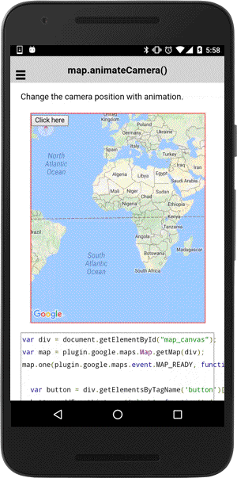

# map.animateCamera()

You can change camera position with animation.

```typescript
this.map.animateCamera(cameraPosition).then(() => {
  ...
});
```

## Parameters

name           | type                                             | description
---------------|--------------------------------------------------|---------------------------------------
cameraPosition | [cameraPosition](../../cameraPosition/README.md) | new camera position

## Return value

:arrow_right: Returns `Promise<any>`

----------------------------------------------------------------------------------------------------------

## Demo code

```html
<div class="map" id="map_canvas">
    <button ion-button (click)="onButton_click($event)">Click here</button>
</div>
```

```typescript
map: GoogleMap;

loadMap() {
  this.map = GoogleMaps.create('map_canvas');
}

onButton_click() {
  this.map.animateCamera({
    target: {lat: 37.422359, lng: -122.084344},
    zoom: 17,
    tilt: 60,
    bearing: 140,
    duration: 5000,
    padding: 0  // default = 20px
  }).then(() => {
    alert("Camera target has been changed");
  });

}

```


