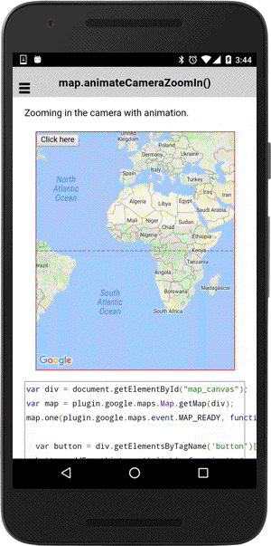

# map.animateCameraZoomIn()

Zooming in the camera with animation.

```typescript
this.map.animateCameraZoomIn().then(() => {
  ...
});
```

## Return value

:arrow_right: Returns `Promise<any>`

----------------------------------------------------------------------------------------------------------

## Demo code

```html
<div id="map_canvas">
  <button ion-button (click)="onButton_click($event)">Click here</button>
</div>
```

```typescript
map: GoogleMap;

loadMap() {
  this.map = GoogleMaps.create('map_canvas');
}

onButton_click() {
  this.map.animateCameraZoomIn();
}
```


