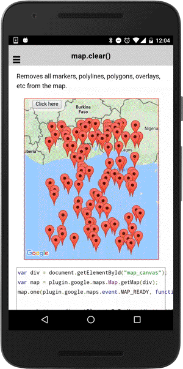

# map.clear()

Removes all markers, polylines, polygons, overlays, etc from the map.

```typescript
this.map.clear().then(() => {
  ...
});
```

## Return value

:arrow_right: Returns `Promise<void>`

----------------------------------------------------------------------------------------------------------

```html
<div class="map" id="map_canvas">
    <span class="smallPanel"><button>Click here</button></span>
</div>
```

```typescript
map: GoogleMap;

loadMap() {
  this.map = GoogleMaps.create('map_canvas');

  this.map.one(GoogleMapsEvent.MAP_READY).then(() => {
    console.log("map is ready to use.");

    // Puts random markers on the map.
    // (In order to use `map.getVisibleRegion()`, wait the MAP_READY event)
    this.createMarkers();
  });
}

onButton_click() {
  // Removes the markers completely.
  this.map.clear().then(() => {
    alert("completed");
  });

}

createMarkers() {
  let latLngBounds: VisibleRegion = this.map.getVisibleRegion();
  let sw: ILatLng = latLngBounds.southwest;
  let ne: ILatLng = latLngBounds.northeast;
  let diffY: number = (ne.lat - sw.lat);
  let diffX: number = (ne.lng - sw.lng);

  for (let i = 0; i < 100; i++) {
    this.map.addMarkerSync({
      'position': {
        'lat': sw.lat + diffY * Math.random(),
        'lng': sw.lng  + diffX * Math.random()
      }
    });
  }

}
```


