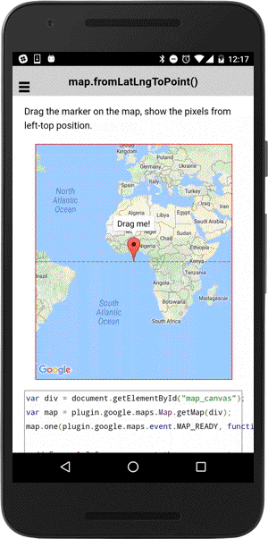

# map.fromLatLngToPoint()

Convert the unit from LatLng to the pixels from the left/top of the map div.

```typescript
this.map.fromLatLngToPoint(latLng).then(() => {
  ...
});
```

## Parameters

name           | type                               | description
---------------|------------------------------------|---------------------------------------
latLng         | [ILatLng](../../ilatlng/README.md) | position

## Return value

:arrow_right: Returns `Promise<any[]>`

----------------------------------------------------------------------------------------------------------

## Demo code

```html
<div class="map" id="map_canvas"></div>
```

```typescript
map: GoogleMap;

loadMap() {
  this.map = GoogleMaps.create('map_canvas');

  let center: ILatLng = this.map.getCameraTarget();
  let marker: Marker = this.map.addMarkerSync({
    position: center,
    draggable: true,
    title: "Drag me!"
  });
  marker.showInfoWindow();
  marker.on(GoogleMapsEvent.MARKER_DRAG_END).subscribe(this.onMarkerDragEnd.bind(this));
}


onMarkerDragEnd(params: any[]) {
  let latLng: LatLng = <LatLng>params[0];
  let marker:Marker = <Marker>params[1];
  console.log(latLng, marker);

  // LatLng -> Point
  this.map.fromLatLngToPoint(latLng).then((point: any[]) => {

    // Show on the marker
    marker.setTitle("left : " + point[0].toFixed(1) + "px\n" + "top : " + point[1].toFixed(1) + "px");
    marker.showInfoWindow();
  });
}

```


