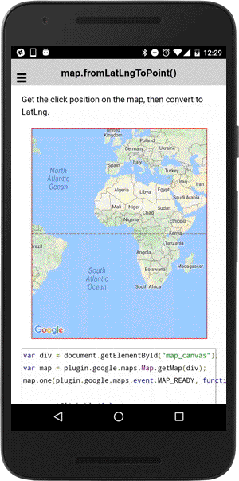

# map.fromPointToLatLng()

Convert the unit from the pixels from the left/top to the LatLng.

```typescript
this.map.fromPointToLatLng([x, y]).then(() => {
  ...
});
```

## Parameters

name           | type      | description
---------------|-----------|---------------------------------------
point          | number[2] | x,y from the left-top of the map div.

## Return value

:arrow_right: Returns `Promise<any[]>`

----------------------------------------------------------------------------------------------------------

## Demo code

```html
<div class="map" id="map_canvas"></div>
```

```typescript
map: GoogleMap;
@ViewChild('map_canvas'):map_canvas;

loadMap() {
  this.map = GoogleMaps.create(this.map_canvas.nativeElement);

  this.map.setClickable(false);

  let mapDiv: any = this.map_canvas.nativeElement;

  mapDiv.addEventListener("click", (e) => {
    // Get the tapped position by pixels
    let clickX: number = e.pageX - mapDiv.offsetLeft;
    let clickY: number = e.pageY - mapDiv.offsetTop;

    // Trigger the `div_click` event
    this.map.trigger('div_click', clickX, clickY);
  });

  this.map.on('div_click').subscribe((params: any[]) => {
    let clickX: number = params[0];
    let clickY: number = params[1];

    // Convert point to LatLng.
    this.map.fromPointToLatLng(params).then((latLng: LatLng) => {
      console.log(latLng.toUrlValue());
      // Add a marker
      let marker: Marker = this.map.addMarkerSync({
        position: latLng,
        title: [
          "Point: x = " + clickX + ", y = " + clickY,
          "LatLng: " + latLng.toUrlValue()
        ].join("\n")
      });
      marker.showInfoWindow();
    });
  });
}
```


