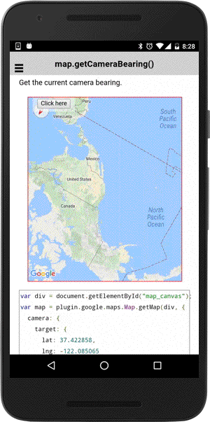

# map.getCameraBearing()

Get the current camera bearing.

```typescript
this.map.getCameraBearing();
```

## Return value

:arrow_right: Returns `number`

----------------------------------------------------------------------------------------------------------

## Demo code

```html
<div class="map" id="map_canvas">
    <span class="smallPanel"><button>Click here</button></span>
</div>
```

```typescript
map: GoogleMap;

constructor(private alertCtrl: AlertController) {}

ionViewDidLoad() {
  this.loadMap();
}
loadMap() {
  this.map = GoogleMaps.create('map_canvas', {
    camera: {
      target: {
        lat: 37.422858,
        lng: -122.085065
      },
      zoom: 0,
      bearing: 150
    }
  });

  this.map.one(GoogleMapsEvent.MAP_READY).then(() => {
    console.log('map is ready');
  })
}

onButton_click() {
  // Show the current camera bearing.
  let text: string = "bearing: " + this.map.getCameraBearing();

  let alert = this.alertCtrl.create({
    title: 'Current camera zoom level',
    subTitle: text,
    buttons: ['Dismiss']
  });
  alert.present();
}
```


