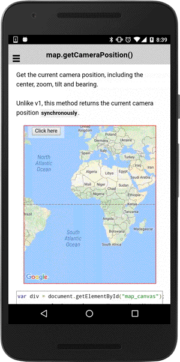

# map.getCameraPosition()

Get the current [camera position](../../CameraPosition/README.md).

```typescript
this.map.getCameraPosition();
```

## Return value

:arrow_right: Returns `CameraPosition<ILatLng>`

----------------------------------------------------------------------------------------------------------

```html
<div class="map" id="map_canvas">
    <span class="smallPanel"><button>Click here</button></span>
</div>
```

```typescript
map: GoogleMap;

constructor(private alertCtrl: AlertController) {
}

loadMap() {
  this.map = GoogleMaps.create("map_canvas");
}

onButton_click() {
  // Get the current camera position.
  let cameraPosition: CameraPosition<ILatLng> = this.map.getCameraPosition();

  // Show the results
  let text: string = ["Current camera position:\n",
    "-------------------------------",
    "latitude:" + cameraPosition.target.lat,
    "longitude:" + cameraPosition.target.lng,
    "zoom:" + cameraPosition.zoom,
    "tilt:" + cameraPosition.tilt,
    "bearing:" + cameraPosition.bearing].join("<br>\n");

  let alert = this.alertCtrl.create({
    title: 'Current camera target',
    subTitle: text,
    buttons: ['Dismiss']
  });
  alert.present();
}

```


