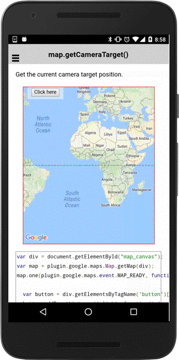

# map.getCameraTarget()

Get the current camera target(latitude/longitude) position.

```typescript
this.map.getCameraTarget();
```

## Return value

:arrow_right: Returns `number`

----------------------------------------------------------------------------------------------------------

## Demo code

```html
<div class="map" id="map_canvas">
    <span class="smallPanel"><button>Click here</button></span>
</div>
```

```typescript
map: GoogleMap;

constructor(private alertCtrl: AlertController) {
}

loadMap() {

  this.map = GoogleMaps.create("map_canvas");
}

onButton_click() {
  // Show the current camera target position.
  let target: ILatLng = this.map.getCameraTarget();

  let alert = this.alertCtrl.create({
    title: 'Current camera target',
    subTitle: [
      "lat: " + target.lat,
      "lng: " + target.lng
    ].join("<br />"),
    buttons: ['Dismiss']
  });
  alert.present();
}
```


