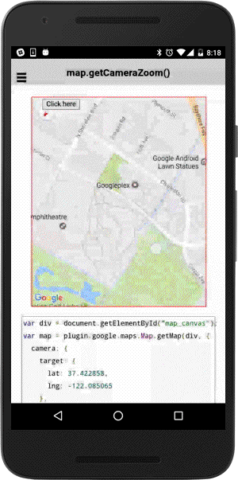

# map.getCameraZoom()

Get the current camera zoom level.

```typescript
this.map.getCameraZoom();
```

## Return value

:arrow_right: Returns `number`

----------------------------------------------------------------------------------------------------------

## Demo code

```html
<div class="map" id="map_canvas">
    <span class="smallPanel"><button>Click here</button></span>
</div>
```

```typescript
map: GoogleMap;

constructor(private alertCtrl: AlertController) {
}

loadMap() {

  this.map = GoogleMaps.create("map_canvas");
}

onButton_click() {
  let text:string = "zoom: " + this.map.getCameraZoom();

  let alert = this.alertCtrl.create({
    title: 'Current camera zoom level',
    subTitle: text,
    buttons: ['Dismiss']
  });
  alert.present();
}
```


