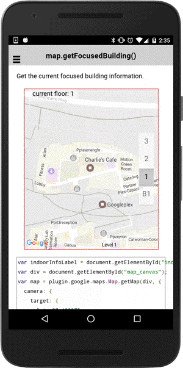

# map.getFocusedBuilding()

Get the current focused building information.

```typescript
this.map.getFocusedBuilding().then((building: any) => {
  ...
});
```

## Return value

:arrow_right: Returns `Promise<any>`

----------------------------------------------------------------------------------------------------------

## Demo code

```html
<div class="map" id="map_canvas">
  <span class="smallPanel" id="indoorInfo"></span>
</div>
```

```typescript
map: GoogleMap;
label: string;

constructor(private _ngZone: NgZone) {}

loadMap() {
  this.map = GoogleMaps.create('map_canvas', {
    camera: {
      target: {
        lat: 37.422375,
        lng: -122.084207
      },
      zoom: 18
    },
    controls: {
      indoorPicker: true
    }
  });

  // Wait the MAP_READY before map.getFocusedBuilding()
  this.map.one(GoogleMapsEvent.MAP_READY).then(() => {

    // Get the current focused building programatically.
    this.map.getFocusedBuilding().then((event) => this.onIndoorEvents([event]));

    // or you can listen the INDOOR_BUILDING_FOCUSED and the INDOOR_LEVEL_ACTIVATED events.
    this.map.on(GoogleMapsEvent.INDOOR_BUILDING_FOCUSED).subscribe(this.onIndoorEvents.bind(this));
    this.map.on(GoogleMapsEvent.INDOOR_LEVEL_ACTIVATED).subscribe(this.onIndoorEvents.bind(this));
  });
}

onIndoorEvents(params: any[]) {
  console.log(params);
  let indoorBuilding: any = params[0];

  this._ngZone.run(() => {
    this.label = "current floor: " + indoorBuilding.levels[indoorBuilding.activeLevelIndex].name;
  });
}
```


