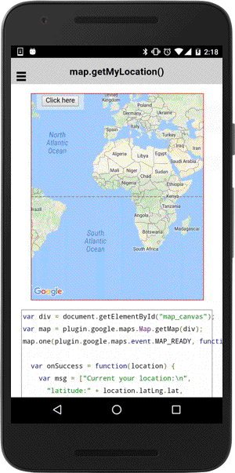

# map.getMyLocation()

Get the current device location.

```typescript
this.map.getMyLocation(options).then((myLocation: MyLocation) => {
  ...
});
```

## Parameters

name           | type                                                | description
---------------|-----------------------------------------------------|---------------------------------------
options        | [MyLocationOptions](../mylocationoptions/README.md) | location request level

## Return value

:arrow_right: Returns `Promise<MyLocation>`

----------------------------------------------------------------------------------------------------------

## Demo code

```html
<div class="map" id="map_canvas">
    <span class="smallPanel"><button>Click here</button></span>
</div>
```

```typescript
map: GoogleMap;

loadMap() {
  this.map = GoogleMaps.create("map_canvas");
}

onButtonClick(event) {
  this.map.getMyLocation().then((location) => {
    let msg: string = [
      "Current your location:\n",
      "latitude:" + location.latLng.lat,
      "longitude:" + location.latLng.lng,
      "speed:" + location.speed,
      "time:" + location.time,
      "bearing:" + location.bearing
    ].join("\n");

    let marker: Marker = this.map.addMarkerSync({
      position: location.latLng,
      title: msg
    });

    let position: CameraPosition<ILatLng> = {
      target: marker.getPosition(),
      zoom: 16
    };

    // move the map's camera to position
    this.map.animateCamera(position).then(() => {
      marker.showInfoWindow();
    });
  });

}
```


