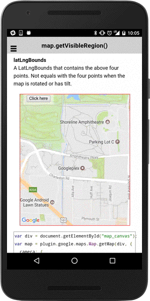

# map.getVisibleRegion()

This method returns [VisibleRegion](../visibleregion/README.md).

```typescript
this.map.getVisibleRegion()
```

## Return value

:arrow_right: Returns `VisibleRegion`

----------------------------------------------------------------------------------------------------------

## Demo code

In the below example, the blue rectangle represents the visible region, the red rectangle represents the viewport region.

This polygon can be a trapezoid instead of a rectangle, because a camera can have tilt. If the camera is directly over the center of the camera, the shape is rectangular, but if the camera is tilted, the shape will appear to be a trapezoid whose smallest side is closest to the point of view.


```typescript

loadMap() {
  this.map = GoogleMaps.create("map_canvas", {
    camera: {
      target: {
        lat: 37.422858,
        lng: -122.085065
      },
      zoom: 15,
      bearing: 150
    }
  });
  this.map.one(GoogleMapsEvent.MAP_READY).then(() => {
    console.log("map is ready");
  });
}

onButton_click() {

  // Get the visible region
  let visibleRegion: VisibleRegion = this.map.getVisibleRegion();


  loadMap() {
    this.map = GoogleMaps.create("map_canvas", {
      camera: {
        target: {
          lat: 37.422858,
          lng: -122.085065
        },
        zoom: 15,
        bearing: 150
      }
    });
  }

  onButton_click() {

    // Get the visible region
    let visibleRegion: VisibleRegion = this.map.getVisibleRegion();

    // Draw a red polygon that represents viewport
    this.map.addPolygonSync({
      'points': [
        visibleRegion.nearLeft,
        visibleRegion.nearRight,
        visibleRegion.farRight,
        visibleRegion.farLeft
      ],
      'strokeColor' : 'red',
      'strokeWidth': 2,
      'fillColor': 'rgba(255, 0, 0, 0.5)'
    });

    setTimeout(() => {
      this.map.animateCameraZoomOut()
    }, 1000);

    // Draw a blue box that represents latLngBounds
    this.map.addPolygonSync({
      'points': [
        visibleRegion.northeast,
        {lat: visibleRegion.northeast.lat, lng: visibleRegion.southwest.lng},
        visibleRegion.southwest,
        {lat: visibleRegion.southwest.lat, lng: visibleRegion.northeast.lng}
      ],
      'strokeColor' : 'blue',
      'strokeWidth': 2,
      'fillColor': 'transparent'
    });

  }

}
```


