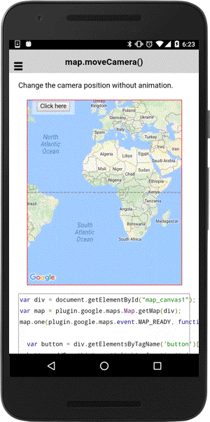

# map.moveCamera()

You can change camera position **without** animation.

```typescript
map.moveCamera(cameraPosition).then(() => {

})
```

## Parameters

name           | type                                             | description
---------------|--------------------------------------------------|---------------------------------------
cameraPosition | [cameraPosition](../../cameraPosition/README.md) | new camera position. **duration** property is ignored.

## Return value

:arrow_right: Returns `Promise<any>`

----------------------------------------------------------------------------------------------------------

## Demo code

```html
<div class="map" id="map_canvas">
  <button ion-button (click)="onButtonClick()">
  Click here
  </button>
</div>
```

```typescript
map: GoogleMap;

loadMap() {
  this.map = GoogleMaps.create("map_canvas");
}

onButtonClick() {
  this.map.moveCamera({
    target: {lat: 37.422359, lng: -122.084344},
    zoom: 17,
    tilt: 60,
    bearing: 140
  }).then(() => {
    alert("Camera target has been changed");
  });
}

```


