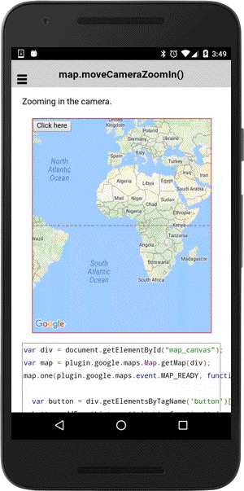

# map.moveCameraZoomIn()

Zooming in the camera without animation.

```typescript
map.moveCameraZoomIn().then(() => {

})
```

## Return value

:arrow_right: Returns `Promise<any>`

----------------------------------------------------------------------------------------------------------

## Demo code

```html
<div id="map_canvas">
    <button>Click here</button>
</div>
```

```typescript
map: GoogleMap;

loadMap() {
  this.map = GoogleMaps.create('map_canvas');
}

onButton_click() {
  this.map.moveCameraZoomIn();
}
```


