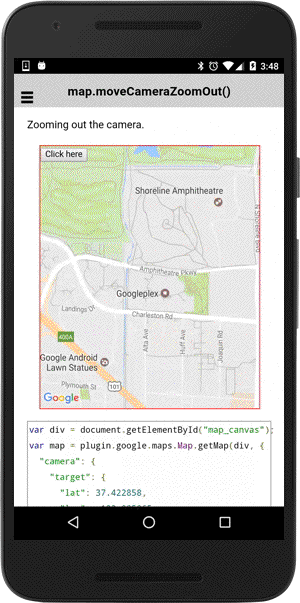

# map.moveCameraZoomOut()

Zooming out the camera without animation.

```typescript
map.moveCameraZoomOut().then(() => {

})
```

## Return value

:arrow_right: Returns `Promise<any>`

----------------------------------------------------------------------------------------------------------

## Demo code

```html
<div id="map_canvas">
    <button>Click here</button>
</div>
```

```typescript
map: GoogleMap;

loadMap() {
  this.map = GoogleMaps.create('map_canvas', {
    "camera": {
      "target": {
        "lat": 37.422858,
        "lng": -122.085065
      },
      "zoom": 15
    }
  });
}

onButton_click() {
  this.map.moveCameraZoomOut();
}

```


