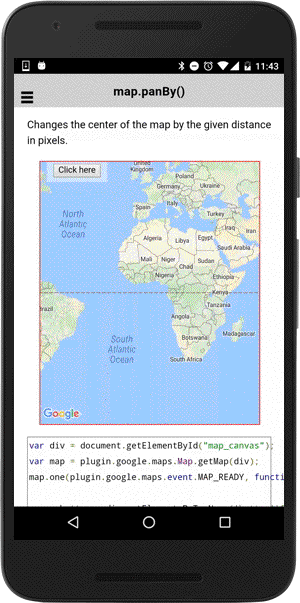

# map.panBy()

Changes the center of the map by the given distance in pixels.

```typescript
map.panBy(x, y)
```

## Parameters

name           | type     | description
---------------|----------|---------------------------------------
x              | number   | distance x in pixels
y              | number   | distance y in pixels

----------------------------------------------------------------------------------------------------------

## Demo code

```html
<div class="map" id="map_canvas">
    <span class="smallPanel"><button>Click here</button></span>
</div>
```

```typescript
map: GoogleMap;

loadMap() {
  this.map = GoogleMaps.create('map_canvas', {
    camera: {
      target: {lat: 35, lng: 138},
      zoom: 10
    }
  });

  // In order to use the fromPointToLatLng() method, wait the MAP_READY event
  this.map.one(GoogleMapsEvent.MAP_READY)
    .then(() => {
      console.log('Map is ready!');

      // Draw grids
      let canvas:any = document.getElementById("grid_canvas");
      let h = this.map.getDiv().offsetHeight,
        w = this.map.getDiv().offsetWidth;
      canvas.width = w;
      canvas.height = h;

      let ctx = canvas.getContext('2d');
      for (let y = 50; y < h; y+= 50) {
        ctx.beginPath();
        ctx.setLineDash([5,5,5]);
        ctx.moveTo(0, y);
        ctx.lineTo(w, y);
        ctx.stroke();
      }
      for (let x = 50; x < w; x+= 50) {
        ctx.beginPath();
        ctx.setLineDash([5,5,5]);
        ctx.moveTo(x, 0);
        ctx.lineTo(x, h);
        ctx.stroke();
      }

      // Add a marker
      this.map.fromPointToLatLng([50, 100]).then((latLng: LatLng) => {
        this.map.addMarker({
          position: latLng
        });
      });

    });
}

onButtonClick(event) {
  if(this.map) {
    this.map.panBy(50, 50);
  }
}

```


