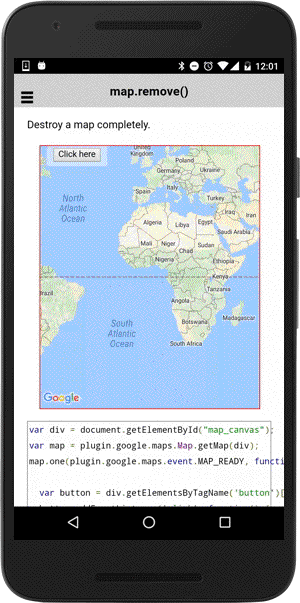

# map.remove()

Destroy a map completely.

```typescript
map.remove()
```

## Return value

:arrow_right: Returns `Promise<void>`

----------------------------------------------------------------------------------------------------------

## Demo code

```html
<div class="map" id="map_canvas">
    <span class="smallPanel"><button>Click here</button></span>
</div>
```

```typescript
map: GoogleMap;

loadMap() {
  this.map = GoogleMaps.create('map_canvas', {
    camera: {
      target: {
        lat: 37.422000,
        lng: -122.084057
      },
      zoom: 15
    }
  });
}

onButtonClick() {
  this.map.remove();
  this.map = null;
}

```


