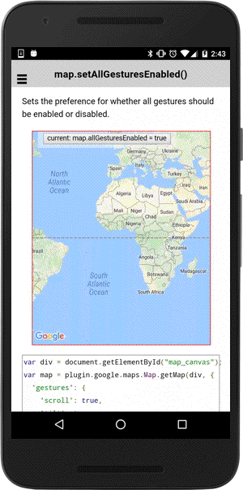

# map.setAllGesturesEnabled()

Sets the preference for whether all gestures should be enabled or disabled.

```typescript
map.setAllGesturesEnabled(flag)
```

## Parameters

name   | type    | description
-------|---------|---------------------------------------
flag   | boolean | `true`: enable, `false`: disable

----------------------------------------------------------------------------------------------------------

## Demo code

```html
<div class="map" id="map_canvas">
  <span class="smallPanel"><button>current: map.allGesturesEnabled = true</button></span>
</div>
```

```typescript
map: GoogleMap;
isEnabled: boolean = true;

loadMap() {
  this.map = GoogleMaps.create('map_canvas', {
    'gestures': {
      'scroll': true,
      'tilt': true,
      'rotate': true,
      'zoom': true
    }
  });
}

onButtonClick() {
  this.isEnabled = !this.isEnabled;
  this.map.setAllGesturesEnabled(this.isEnabled);
}
```


