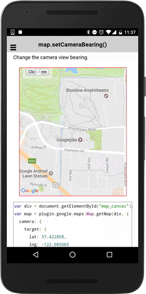

# map.setCameraBearing()

Change the camera view bearing.

```typescript
map.setCameraBearing(bearing)
```

## Parameters

name      | type    | description
----------|---------|---------------------------------------
bearing   | number  | new camera bearing angle (orientation)

----------------------------------------------------------------------------------------------------------

## Demo code

```html
<div class="map" id="map_canvas">
    <span class="smallPanel"><button>Click here</button></span>
</div>
```

```typescript
map: GoogleMap;
bearing: number = 0;

loadMap() {
  this.map = GoogleMaps.create('map_canvas', {
    camera: {
      target: {
        lat: 37.422858,
        lng: -122.085065
      },
      zoom: 15
    }
  });

}
onButtonClick() {
  this.bearing += 15;
  this.map.setCameraBearing(this.bearing);
}
```


