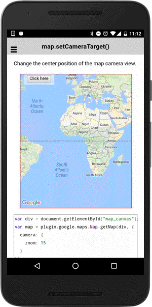

# map.setCameraTarget()

Set the camera target(latitude/longitude) position.

```typescript
map.setCameraTarget(latLng | <a href="../ilatlng/README.md">ILatLng</a>[])
```

## Parameters

name      | type                             | description
----------|----------------------------------|---------------------------------------
latLng    | [ILatLng](../ilatlng/README.md)  | new camera position

----------------------------------------------------------------------------------------------------------

## Demo code

```html
<div class="map" id="map_canvas">
    <span class="smallPanel"><button>Click here</button></span>
</div>
```

```typescript
map: GoogleMap;

loadMap() {
  this.map = GoogleMaps.create('map_canvas', {
    camera: {
      zoom: 15
    }
  });

}

onButtonClick() {
  let GOOGLE: ILatLng = {
    lat: 37.422858,
    lng: -122.085065
  };
  this.map.setCameraTarget(GOOGLE);
  let marker: Marker = map.addMarkerSync({
    position: GOOGLE,
    title: "Google"
  });
  marker.showInfoWindow();
});

```


