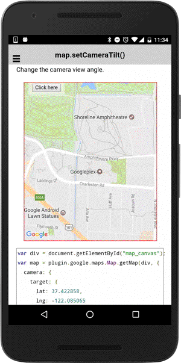

# map.setCameraTilt()

Change the camera view angle.

```typescript
map.setCameraTilt(tilt)
```

## Parameters

name      | type    | description
----------|---------|---------------------------------------
tilt      | number  | new camera view angle

----------------------------------------------------------------------------------------------------------

## Demo code

```html
<div class="map" id="map_canvas">
    <span class="smallPanel"><button>Click here</button></span>
</div>
```

```typescript
map: GoogleMap;
tilt: number = 0;

loadMap() {
  this.map = GoogleMaps.create('map_canvas', {
    camera: {
      target: {
        lat: 37.422858,
        lng: -122.085065
      },
      zoom: 15
    }
  });

}
onButtonClick() {
  this.tilt += 45;
  this.map.setCameraTilt(this.tilt);
});

```


