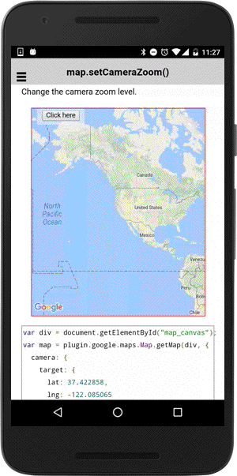

# map.setCameraZoom()

Change the camera zoom level.

```typescript
map.setCameraZoom(tilt)
```

## Parameters

name      | type    | description
----------|---------|---------------------------------------
zoom      | number  | new camera zoom level

----------------------------------------------------------------------------------------------------------

## Demo code

```html
<div class="map" id="map_canvas">
    <span class="smallPanel"><button>Click here</button></span>
</div>
```

```typescript
map: GoogleMap;

loadMap() {
  this.map = GoogleMaps.create('map_canvas', {
    camera: {
      target: {
        lat: 37.422858,
        lng: -122.085065
      }
    }
  });

}
onButtonClick() {
  this.map.setCameraZoom(10);
});

```


