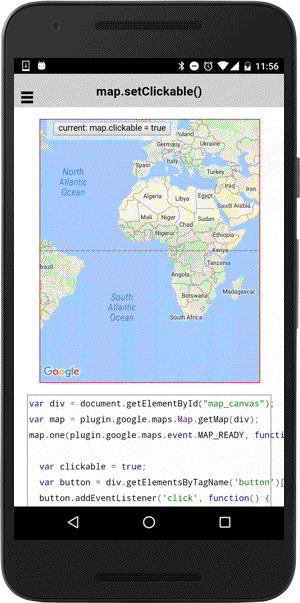

# map.setClickable()

Set false to ignore all clicks on the map (default: true).

```typescript
map.setClickable(flag)
```

## Parameters

name   | type    | description
-------|---------|---------------------------------------
flag   | boolean | `true`: clickable, `false`: non-clickable

----------------------------------------------------------------------------------------------------------

## Demo code

```html
<div class="map" id="map_canvas">
    <span class="smallPanel"><button>current: map.clickable = true</button></span>
</div>
```

```typescript
map: GoogleMap;
clickable: boolean = true;

loadMap() {
  this.map = GoogleMaps.create('map_canvas');

  this.map.on(GoogleMapsEvent.MAP_CLICK).subscribe(() => {
    alert("Click!");
  });
}
onButtonClick() {
  this.clickable = !this.clickable;
  map.setClickable(this.clickable);
});

```


