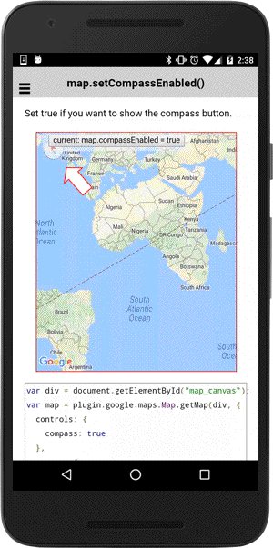

# map.setCompassEnabled()

Set true if you want to show the compass button.

```typescript
map.setCompassEnabled(flag)
```

## Parameters

name   | type    | description
-------|---------|---------------------------------------
flag   | boolean | `true`: show compass, `false`: hide compass

----------------------------------------------------------------------------------------------------------

## Demo code

```html
<div class="map" id="map_canvas">
  <span class="smallPanel"><button>current: map.compassEnabled = true</button></span>
</div>
```

```typescript
map: GoogleMap;
clickable: boolean = true;

loadMap() {
  this.map = GoogleMaps.create('map_canvas', {
    controls: {
      compass: true
    },
    camera: {
      bearing: 30
    }
  });

  this.map.on(GoogleMapsEvent.MAP_CLICK).subscribe(() => {
    alert("Click!");
  });
}
onButtonClick() {
  this.clickable = !this.clickable;
  this.map.setCompassEnabled(isEnabled);
});

```


