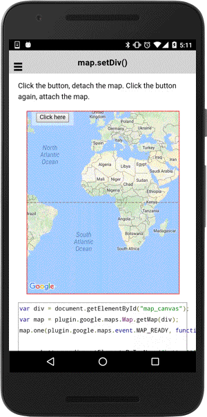

# map.setDiv()

After creating a map, you can change the map div using `map.setDiv()`.

If you specify a new div, the map moves to the div.
If you specify `null`, the map is disappear (but the map is not destroyed yet).

The below code can attach / detach the map when you click the button on the map.

```typescript
map.setDiv(div)
```

## Parameters

name   | type                | description
-------|---------------------|---------------------------------------
div    | string, HTMLElement | (optional) new map container

----------------------------------------------------------------------------------------------------------

## Demo code

```html
<div class="map" id="map_canvas">
    <span class="smallPanel"><button>Click here</button></span>
</div>
```

```typescript
map: GoogleMap;

loadMap() {
  this.map = GoogleMaps.create('map_canvas');

  this.map.on(GoogleMapsEvent.MAP_CLICK).subscribe(() => {
    alert("Click!");
  });
}
onButtonClick() {
  if (this.map.getDiv()) {
    this.map.setDiv();
  } else {
    this.map.setDiv(div);
  }
});

```


