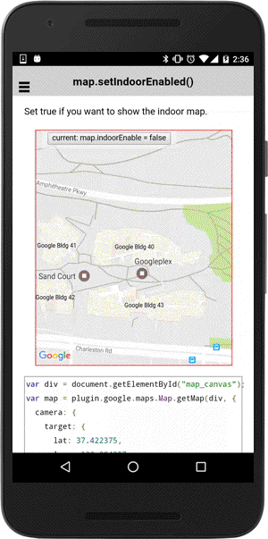

# map.setIndoorEnabled()

Set true if you want to show the indoor map.

```typescript
map.setIndoorEnabled(flag)
```

## Parameters

name   | type    | description
-------|---------|---------------------------------------
flag   | boolean | `true`: enable indoor levels, `false`: ground level only

----------------------------------------------------------------------------------------------------------

## Demo code

```html
<div class="map" id="map_canvas">
  <span class="smallPanel"><button>current: map.indoorEnable = false</button></span>
</div>
```

```typescript
map: GoogleMap;
clickable: boolean = true;

loadMap() {
  this.map = GoogleMaps.create('map_canvas', {
    camera: {
      target: {
        lat: 37.422375,
        lng: -122.084207
      },
      zoom: 17
    },
    controls: {
      indoorPicker: true
    }
  });

  this.map.on(GoogleMapsEvent.MAP_CLICK).subscribe(() => {
    alert("Click!");
  });
}
onButtonClick() {
  this.clickable = !this.clickable;
  this.map.setIndoorEnabled(isEnabled);
});

```


