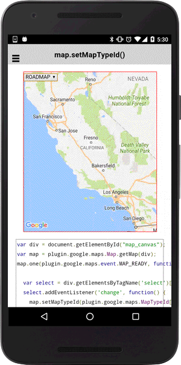

# map.setMapTypeId()

You can change map type using `map.setMapTypeId()`.
Available map types are `ROADMAP`, `SATELLITE`, `HYBRID`, `TERRAIN` and `NONE`.

```typescript
map.setMapTypeId(mapTypeId)
```

## Parameters

name        | type    | description
------------|---------|---------------------------------------
mapTypeId   | string  | One of [GoogleMapsMapTypeId](../maptype/README.md) constants

----------------------------------------------------------------------------------------------------------

## Demo code

```html
<div class="map" id="map_canvas">
  <select>
    <option value="ROADMAP">ROADMAP</option>
    <option value="SATELLITE">SATELLITE</option>
    <option value="HYBRID">HYBRID</option>
    <option value="TERRAIN">TERRAIN</option>
    <option value="NONE">NONE</option>
  </select>
</div>
```

```typescript
map: GoogleMap;
mapTypeId: any;

loadMap() {
  this.map = GoogleMaps.create('map_canvas', {
    mapType: GoogleMapsMapTypeId.ROADMAP
  });

}

onItemSelected(item) {
  this.map.setMapTypeId(GoogleMapsMapTypeId[this.mapTypeId]);
}
```


