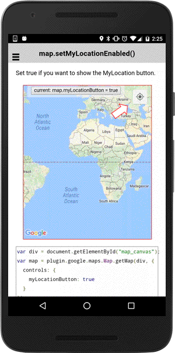

# map.setMyLocationButtonEnabled()

Set true if you want to show the MyLocation button.

```typescript
map.setMyLocationButtonEnabled(flag)
```

## Parameters

name   | type    | description
-------|---------|---------------------------------------
flag   | boolean | `true`: show the myLocation button, `false`: hide it

----------------------------------------------------------------------------------------------------------

## Demo code

```html
<div class="map" id="map_canvas">
    <span class="smallPanel"><button>current: map.myLocationButton = true</button></span>
</div>
```

```typescript
var map = plugin.google.maps.Map.getMap(div, {
  controls: {
    myLocationButton: true,
    myLocation: true
  }
});
var isEnabled = true;
var button = div.getElementsByTagName('button')[0];
button.addEventListener('click', function() {
  isEnabled = !isEnabled;
  map.setMyLocationButtonEnabled(isEnabled);
  button.innerHTML = "current: map.myLocationButton = " + isEnabled;
});

```


