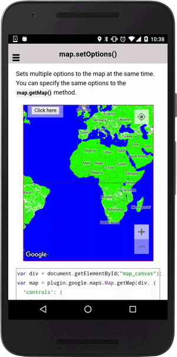

# map.setOptions()

Sets multiple options to the map at the same time. You can specify the same options to the `map.getMap()` method.

```typescript
map.setOptions(options)
```

## Parameters

name      | type                                              | description
----------|---------------------------------------------------|---------------------------------------
options   | [GoogleMapOptions](../googlemapoptions/README.md) | map options

----------------------------------------------------------------------------------------------------------

## Demo code

```html
<div class="map" id="map_canvas">
  <span class="smallPanel"><button>Click here</button></span>
</div>
```

```typescript
map: GoogleMap;
isEnabled: any;

loadMap() {
  this.map = GoogleMaps.create('map_canvas', {
    'controls': {
      'compass': true,
      'myLocationButton': true,
      'indoorPicker': true,
      'zoom': true // Only for Android
    },
    'styles': [
      {
        "featureType": "administrative.land_parcel",
        "stylers": [
          {
            "color": "#23ff00"
          }
        ]
      },
      {
        "featureType": "landscape.natural.landcover",
        "stylers": [
          {
            "color": "#23ff00"
          }
        ]
      },
      {
        "featureType": "landscape.natural.terrain",
        "stylers": [
          {
            "color": "#23ff00"
          }
        ]
      },
      {
        "featureType": "water",
        "stylers": [
          {
            "color": "#0400ff"
          }
        ]
      }
    ]
  });
}
onButtonClick() {

  // Change the map options
  this.map.setOptions({
    'mapType': GoogleMapsMapTypeId.HYBRID,
    'controls': {
      'compass': true,
      'myLocationButton': true,
      'indoorPicker': true,
      'zoom': true,
      'mapToolbar': true   // currently Android only
    },
    'gestures': {
      'scroll': true,
      'tilt': true,
      'rotate': true,
      'zoom': true
    },
    'camera': {
      'target': {
        lat: 37.422848,
        lng: -122.085565
      },
      'tilt': 30,
      'zoom': 15,
      'bearing': 50
    },
    'preferences': {
      'zoom': {
        'minZoom': 0,
        'maxZoom': 3
      },
      'padding': {
        'left': 30,
        'top': 50,
        'bottom': 20,
        'right': 10
      }
    }
  });

});

```


