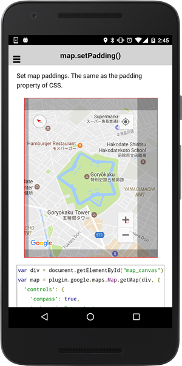

# map.setPadding()

Set map paddings. The same as the padding property of CSS.

```typescript
map.setPadding(top, right, bottom, left)
```

## Parameters

name        | type    | description
------------|---------|---------------------------------------
top         | number  | padding of top in pixels
right       | number  | (optional) padding of right in pixels
bottom      | number  | (optional) padding of bottom in pixels
left        | number  | (optional) padding of left in pixels

----------------------------------------------------------------------------------------------------------

## Demo code

```html
<div class="map" id="map_canvas" style="position:relative;">
    <div style="position:absolute;width:50px;height:100%;right:0;background-color:rgba(0,0,0,0.25);"></div>
    <div style="position:absolute;width:10px;height:100%;background-color:rgba(0,0,0,0.25);"></div>
    <div style="position:absolute;width:100%;height:30px;background-color:rgba(0,0,0,0.25);"></div>
    <div style="position:absolute;width:100%;height:20px;bottom:0;background-color:rgba(0,0,0,0.25);"></div>
</div>
```

```typescript
map: GoogleMap;
isEnabled: any;

loadMap() {
  this.map = GoogleMaps.create('map_canvas', {
    'controls': {
      'compass': true,
      'myLocationButton': true,
      'indoorPicker': true,
      'zoom': true
    },
    'camera': {
      'target': {
        'lat': 41.796875,
        'lng': 140.757007
      },
      'tilt': 30,
      'zoom': 15,
      'bearing': 50
    }
  });
  // Usage case #1:
  // top = right = bottom = left = 30px
  // this.map.setPadding( 30 );

  // Usage case #2:
  // top = bottom = 30px
  // left = right = 50px
  // this.map.setPadding( 30, 50 );

  // Usage case #3:
  // top = 30px
  // left = right = 50px
  // bottom = 20px
  // this.map.setPadding( 30, 50 , 20 );

  // Usage case #4:
  // top = 30px
  // right = 50px
  // bottom = 20px
  // left = 10px
   this.map.setPadding( 30, 50 , 20 , 10 );
}

```


